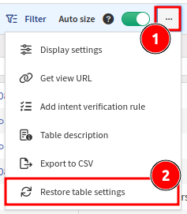

# Overview

The **Technology** tables enable the analysis and correlation of network state information and
parameters on the fly. Most of the tables display live snapshot data
generated by graph algorithms without a pre-existing cache. The first
load of a large table usually takes longer than subsequent loads;
however, all tables were built to handle large capacities and complex
queries, so the outcome is likely to be better than analyzing the output
in external applications like Excel.

## Network or Site View

Tables display data for the whole network by default. To only display
data for a specific site, select "site" from the drop-down menu on the
top left.

## Table Filtering

Simple or advanced filters can be applied to each table. By default,
filtering is available above each column, and accepted filtering values
can be strings, numbers, IP addresses, networks, Boolean values, or
select box values.

### RegEx Simple Column Filter Examples

- `=~(cis|ari)` -- RegEx matches also `cisco` or `arista` values (not exact match).
- `=~^(cisco|arista)$` -- RegEx matches `cisco` or `arista` values only (exact match).
- `=cisco` -- Matches only `cisco` values (exact match).
- `cis` -- Matches `cis` or `cisco` (prefix match).
- `=~^(?!cisco)` -- RegEx negative lookahead -- matches all except values starting with `cisco`.

Some columns containing IP addresses (such as `Login IP` within **Inventory -->
Devices**) can be filtered by entering the IP/prefix length in CIDR notation.
For example, `10.0.0.0/25` will find addresses between and including
`10.0.0.128` and `10.0.0.255`.

### Additional Operators for Routing Columns

Columns containing IPv4 prefixes (such as `Route` within **Technology -->
Routing --> Routes**) have:

- an additional operator "contains IP address" (API: `ip`, UI: `IP:`)

  !!! example

      `IP:192.168.127.129` will match any prefix containing that IP address,
      such as `192.168.127.0/24` or `192.168.0.0/16`, but not
      `192.168.128.0/24`.

- as well as a set of CIDR operators:
  - is strict supernet (API: `gt`, UI: `>`)
  - is supernet (API: `gte`, UI: `>=`)
  - is strict subnet (API: `lt`, UI: `<`)
  - is subnet (API: `lte`, UI: `<=`)
  - overlaps (API: `sect`, UI: `@`)
  - does not overlap (API: `nsect`, UI: `!@`)

### Advanced Filters

Advanced filters can be used to construct arbitrarily complex expressions
by combining nested filters and filter groups with any number of logical
AND and OR operators between them. Advanced filters can be saved and
recalled for each specific table. Filters are stored per table and are
available to all users.

#### Device-based advanced filters

Supported device properties:

- Vendor
- Family
- Model
- Platform
- Version
- Image
- Type
- Login Ip
- Domain
- API Slug

Support tables:

- **Inventory**
  - **Part numbers**
  - **Interfaces**
  - **End of Life Milestones**
    - Detail
- **Technology**
  - **Platforms**
    - Cisco FEX
      - Interfaces
    - Cisco VSS
      - VSS
      - Chassis
      - VSL
    - PoE
      - Devices
      - Interfaces
      - Modules
    - Stacks
      - Stacks
      - Members
      - Stack Ports
    - Environment
      - Power Supplies
      - Power Supplies Fans
      - Fans
      - Modules
      - Temperature sensors
    - Cisco FabricPath
      - Summary
      - IS-IS neighbors
      - Switch IDs
      - Routes
    - Logical Devices
  - **Interfaces**
    - Current Rates - Data
      - Inbound
      - Outbound
      - Bidirectional
    - Average Rates - Data
      - Inbound
      - Outbound
      - Bidirectional
    - Average Rates - Errors
      - Inbound
      - Outbound
      - Bidirectional
    - Average Rates - Drops
      - Inbound
      - Outbound
      - Bidirectional
    - Duplex
    - Connectivity matrix
      - Connectivity Matrix
    - Switchport
    - MTU
    - Storm Control
      - Broadcast
      - Unicast
      - Multicast
      - All traffic
    - Transceivers
      - Inventory
      - Statistics
      - Triggered thresholds
      - Errors
    - PPPoE
      - PPPoE sessions
    - Counters
      - Inbound
      - Outbound
    - Tunnels
      - IPv4 Tunnels
      - IPv6 Tunnels
  - **CDP/LDP**
    - All neighbors
    - Unmanaged neighbors
    - Unidirectional neighbors
    - Endpoints neighbors
  - **DHCP**
    - Relay
      - Interfaces
      - Interfaces stats
        - Received
        - Relayed
        - Sent
      - Global Stats
        - Summary
        - Received
        - Relayed
        - Sent
    - Server
      - Summary
      - Pools
      - Leases
      - Excluded Ranges
      - Interfaces
  - **Port channels**
    - Inbound Balancing table
    - Outbound Balancing table
    - Member status table
    - MLAG
      - Switches
      - Peer links
      - Pairs
      - Cisco VPC
  - **VLANs**
    - Device Summary
    - Device Detail
  - **Spanning Tree**
    - STP bridges
    - STP VLANs
    - STP virtual ports
    - STP neighbors
    - STP Guards
    - STP Inconsistencies
      - VLANs without STP
        - Summary
        - Detail
      - Neighbor ports allowed VLAN mismatch
      - Ports with multiple neighbors
      - STP/CDP ports mismatch
      - Multiple STP between two devices
  - **Addressing**
    - ARP Table
    - MAC Table
    - Managed IP
      - IPv4 Managed IP
      - IPv6 Managed IP
    - NAT
    - IPv6 Neighbor discovery
  - **FHRP**
    - GLBP Forwarders
    - Virtual Gateways
  - **Networks**
    - Managed networks
    - Gateway redundancy
  - **Routing**
    - Routes
      - IPv4 Routes
      - IPv6 Routes
    - OSPF
      - Neighbors
      - Interfaces
    - OSPF v3
      - Neighbors
      - Interfaces
    - BGP
      - Neighbors
      - Address Families
      - Advertised Routes
    - EIGRP
      - Neighbors
      - Interfaces
    - RIP
      - Neighbors
      - Interfaces
    - IS-IS
      - Neighbors
      - Interfaces
      - Levels
    - VRF
      - Detail
      - Interfaces
    - Prefix lists
      - IPv4
      - IPv6
    - LISP
      - Routes
        - IPv4
        - IPv6
      - Map Resolvers
        - IPv4
        - IPv6
    - Routing policy
      - Routing Policies
      - PBR Interfaces
      - Policy Based Routing
  - **MPLS**
    - LDP
      - Neighbors
      - Interfaces
    - RSVP
      - Neighbors
      - Interfaces
    - Forwarding
    - L3 VPN
      - PE Routers
      - VRF on PE
      - VRF Route Targets
      - PE Routes
    - L2 VPN
      - Point to point - VPWS
      - Point to multipoint - VPLS
      - Circuit cross-connect
      - All pseudowires
  - **Multicast**
    - PIM
      - Neighbors
      - Interfaces
    - MRoute
      - Overview
      - MRoute table
      - OIL Detail
      - MRoute counters
      - First hop router
      - Sources
    - IGMP
      - Groups
      - Interfaces
    - IGMP Snooping
      - Global Configuration
      - Groups
      - Vlans Configuration
    - MAC
    - RP
      - RP Overview
      - BSR
      - RP Mappings
      - RP Mappings groups
  - **Platforms**
    - Cisco FEX
      - Interfaces
    - Cisco VSS
      - VSS
      - Chassis
      - VSL
    - PoE
      - Devices
      - Interfaces
      - Modules
    - Stacks
      - Stacks
      - Members
      - Stack Ports
    - Environment
      - Power Supplies
      - Power Supplies Fans
      - Fans
      - Modules
      - Temperature sensors
    - Cisco FabricPath
      - Summary
      - IS-IS neighbors
      - Switch IDs
      - Routes
    - Logical Devices
  - **Interfaces**
    - Current Rates - Data
      - Inbound
      - Outbound
      - Bidirectional
    - Average Rates - Data
      - Inbound
      - Outbound
      - Bidirectional
    - Average Rates - Errors
      - Inbound
      - Outbound
      - Bidirectional
    - Average Rates - Drops
      - Inbound
      - Outbound
      - Bidirectional
    - Duplex
    - Connectivity matrix
      - Connectivity Matrix
    - Switchport
    - MTU
    - Storm Control
      - Broadcast
      - Unicast
      - Multicast
      - All traffic
    - Transceivers
      - Inventory
      - Statistics
      - Triggered thresholds
      - Errors
    - PPPoE
      - PPPoE sessions
    - Counters
      - Inbound
      - Outbound
    - Tunnels
      - IPv4 Tunnels
      - IPv6 Tunnels
  - **CDP/LLDP**
    - All neighbors
    - Unmanaged neighbors
    - Unidirectional neighbors
    - Endpoints neighbors
  - **DHCP**
    - Relay
      - Interfaces
      - Interfaces stats
      - Received
      - Relayed
      - Sent
      - Global Stats
      - Summary
      - Received
      - Relayed
      - Sent
    - Server
      - Summary
      - Pools
      - Leases
      - Excluded Ranges
      - Interfaces
  - **Port channels**
    - Inbound Balancing table
    - Outbound Balancing table
    - Member status table
    - MLAG
      - Switches
      - Peer links
      - Pairs
      - Cisco VPC
  - **VLANs**
    - Device Summary
    - Device Detail
  - **Spanning Tree**
    - STP bridges
    - STP VLANs
    - STP virtual ports
    - STP neighbors
    - STP Guards
    - STP Inconsistencies
      - VLANs without STP
      - Summary
      - Detail
      - Neighbor ports allowed VLAN mismatch
      - Ports with multiple neighbors
      - STP/CDP ports mismatch
      - Multiple STP between two devices
  - **Addressing**
    - ARP Table
    - MAC Table
    - Managed IP
      - IPv4 Managed IP
      - IPv6 Managed IP
    - NAT
    - IPv6 Neighbor discovery
  - **FHRP**
    - GLBP Forwarders
    - Virtual Gateways
  - **Networks**
    - Managed networks
    - Gateway redundancy
  - **Routing**
    - Routes
      - IPv4 Routes
      - IPv6 Routes
    - OSPF
      - Neighbors
      - Interfaces
    - OSPF v3
      - Neighbors
      - Interfaces
    - BGP
      - Neighbors
      - Address Families
      - Advertised Routes
    - EIGRP
      - Neighbors
      - Interfaces
    - RIP
      - Neighbors
      - Interfaces
    - IS-IS
      - Neighbors
      - Interfaces
      - Levels
    - VRF
      - Detail
      - Interfaces
    - Prefix lists
      - IPv4
      - IPv6
    - LISP
      - Routes
      - IPv4
      - IPv6
      - Map Resolvers
      - IPv4
      - IPv6
    - Routing policy
      - Routing Policies
      - PBR Interfaces
      - Policy Based Routing
  - **MPLS**
    - LDP
      - Neighbors
      - Interfaces
    - RSVP
      - Neighbors
      - Interfaces
    - Forwarding
    - L3 VPN
      - PE Routers
      - VRF on PE
      - VRF Route Targets
      - PE Routes
    - L2 VPN
      - Point to point - VPWS
      - Point to multipoint - VPLS
      - Circuit cross-connect
      - All pseudowires
  - **Management**
    - AAA
      - Servers
      - Lines
      - Authentication
      - Authorization
      - Accounting
      - Local Users
      - Password Strength
    - Banners
      - Summary
      - Banners
    - Telnet access
    - NTP
      - Summary
      - Sources
    - Port Mirroring
    - Logging
      - Summary
      - Remote Services
      - Local Services
    - Flow
      - Flow Overview
      - NetFlow Devices
      - NetFlow Collectors
      - NetFlow Interfaces
      - sFlow Devices
      - sFlow Collectors
      - sFlow Data Sources
    - SNMP
      - Summary
      - Communities
      - Trap Hosts
      - Users
    - PTP
      - PTP Local Clock
      - PTP Masters
      - PTP Interfaces
    - Licenses
      - License
      - Summary
      - License Detail
      - Cisco Smart License
      - Authorization
      - Registration
      - Reservations
    - DNS resolver
      - Settings
      - Servers
  - **Security**
    - ACL
      - ACL Policies
      - ACL Interfaces
      - Global ACL policies
    - DMVPN
    - DHCP Snooping
      - Configuration
      - Binding Database
    - IPsec
      - IPsec tunnels
      - IPsec gateways
    - Secure ports - 802.1x
      - Devices
      - Interfaces
      - Users
    - Zone Firewall
      - Policies
      - Interfaces
  - **Load-balancing**
    - Virtual Servers - Pools
    - Virtual Servers - Pool members
    - Partitions
  - **Wireless**
    - Controllers
    - Access points
    - Radios/BSSID
      - Radios Detail
    - Clients
  - **IP Telephony**
    - Phones
  - **SDN**
    - ACI
      - Endpoint
      - VLAN
      - VRF
      - DTEP
    - VXLAN
      - VTEP
      - Peers
      - Interfaces
      - VNI
    - APIC
      - Controllers
  - **SDWAN**
    - Silverpeak
      - Overlay
      - Underlay
    - Versa
      - Sites
      - Transport Links
    - Viptela
      - BFD Sessions
      - Control Connections
      - BFD Summary
  - **QoS**
    - Applied Service-Policies
    - Shaping
    - Queueing
    - Policing
    - Priority
    - Marking
    - Random Drops
  - **OAM**
    - UDLD
      - Neighbors
      - Interfaces
  - **Cloud**
    - Endpoints
      - Virtual Machines
      - Virtual Machines Interfaces
  
!!! note

    Neigbors tables support only local device in this filters.

## Table Exports

Table outputs can be exported into CSV format for further processing, and
the text can be opened by any spreadsheet processor. In some cases,
Microsoft Excel and Google Spreadsheets convert strings from the CSV
files into dates, but these can remain as exact values by renaming the
content to `string` to force the spreadsheet to retain the original
content.

!!! note

    It may take several seconds to prepare an export of large tables.

## Tooltips

Each table contains built-in help in `Table description` under the `...` menu
(in the top-right corner of the table):

.

Hover the mouse cursor over a column header for the column's description:

## Column Visibility

Tables can be especially large to facilitate easier information correlation;
however, not all columns need to always be visible.

Select `Display settings` under the `...` menu and choose which columns to show
or hide:

## Column Size

Use the `Auto size` toggle to either automatically size columns to fit their
current content (when enabled) or let columns remember user-defined widths
(when disabled):

## Persistent Table View

To improve usability, each table remembers the settings and filtering for each
user.

To reset a table to its original state, select `Restore table settings` under
the `...` menu:

## Regular Expression Syntax

A regular expression may consist of literal characters and the following characters and sequences:

- `.` -- The dot matches any single character except line terminators. To include line terminators, use `[\s\S]` instead to simulate `.` with the `DOTALL` flag.
- `\d` -- Matches a single digit, equivalent to `[0-9]`.
- `\s` -- Matches a single whitespace character.
- `\S` -- Matches a single non-whitespace character.
- `\b` -- Matches a word boundary. This match is zero-length.
- `\B` -- Negation of `\b`. The match is zero-length.
- `[xyz]` -- Set of characters. Matches any of the enclosed characters (here `x`, `y`, or `z`).
- `[^xyz]` -- Negated set of characters. Matches any other character than the enclosed ones (i.e., anything but `x`, `y`, or `z` in this case).
- `[x-z]` -- Range of characters. Matches any of the characters in the specified range (e.g., `[0-9A-F]` to match any character in `0123456789ABCDEF`).
- `[^x-z]` -- Negated range of characters. Matches any other character than the ones specified in the range.
- `(xyz)` -- Defines and matches a pattern group. Also defines a capturing group.
- `(?:xyz)` -- Defines and matches a pattern group without capturing the match.
- `(xy|z)` -- Matches either `xy` or `z`.
- `^` -- Matches the beginning of the string (e.g., `^xyz`).
- `$` -- Matches the end of the string (e.g., `xyz$`).

To literally match one of the characters that have a special meaning in regular expressions (`.`, `*`, `?`, `[`, `]`, `(`, `)`, `{`, `}`, `^`, `$`, and `\`), you may need to escape the character with a backslash, which typically requires escaping itself. The backslash of shorthand character classes like `\d`, `\s`, and `\b` counts as literal backslash. However, the backslash of JSON escape sequences like `\t` (tabulation), `\r` (carriage return), and `\n` (line feed) does not.

!!! note "Literal Backlashes Require Different Amounts of Escaping Depending on the Context"

    - `\` in bind variables (Table view mode) in the web UI (automatically escaped to `\\` unless the value is wrapped in double quotes and already escaped properly).
    - `\\` in bind variables (JSON view mode) and queries in the web UI.
    - `\\` in bind variables in `arangosh`.
    - `\\\\` in queries in `arangosh`.
    - Double the amount compared to `arangosh` in shells that use backslashes for escaping (`\\\\` in bind variables and `\\\\\\\\` in queries).

Characters and sequences may optionally be repeated using the following quantifiers:

- `x?` -- Matches one or zero occurrences of `x`.
- `x*` -- Matches zero or more occurrences of `x` (greedy).
- `x+` -- Matches one or more occurrences of `x` (greedy).
- `x*?` -- Matches zero or more occurrences of `x` (non-greedy).
- `x+?` -- Matches one or more occurrences of `x` (non-greedy).
- `x{y}` -- Matches exactly y occurrences of `x`.
- `x{y,z}` -- Matches between y and z occurrences of `x`.
- `x{y,}` -- Matches at least y occurrences of `x`.

Note that `xyz+` matches `xyzzz`, but if you want to match `xyzxyz` instead, you need to define a pattern group by wrapping the sub-expression in parentheses and place the quantifier right behind it, like `(xyz)+`.

You can use 3rd-party services, like [regex101](https://regex101.com/), to fine-tune and troubleshoot your regular expressions.

## Create Links to Table Views

To point to a particular dataset, the link may include
[a snapshot ID that IP Fabric will switch to](../discovery_snapshot.md#create-url-pointing-to-specific-snapshot) after opening.

Also, you can generate the link in two forms:

1. A short form, like
   `https://<IPF_IP_or_FQDN>/inventory/devices?copyId=916264918z`, is 
   useful for sharing.
2. A long URL that contains the filter definition in JSON format:
   `https://<IPF_IP_or_FQDN>/inventory/devices?options=%7B"filters"%3A%7B"and"%3A%5B%7B"hostname"%3A%5B"like"%2C"L7"%5D%7D%2C%7B"or"%3A%5B%7B"vendor"%3A%5B"eq"%2C"cisco"%5D%7D%2C%7B"vendor"%3A%5B"eq"%2C"fortinet"%5D%7D%5D%7D%5D%7D%7D`.
   - These URLs can be used, for example, to generate templates for your
     automations. You can prepare the structure of a filter using the **Advanced
     Filter** GUI, then replace values with variables in your automation 
     scripts.

## Pin Pages to the Main Menu for Quick Access

### Pin a Page to the Main Menu

To pin any page in the Technology Tables, click the pin button next to the table name. The page will instantly appear in the left Main Menu.

{ width="250" }

### Unpin a Page from the Main Menu

If you no longer want it in the Menu, you can unpin it by clicking the pin in the Main Menu or by clicking the pin next to the page title again.

{ width="250" }
