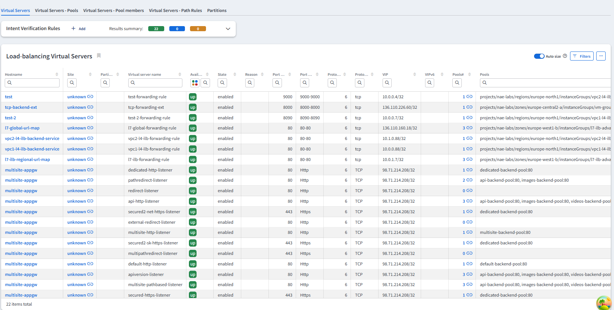
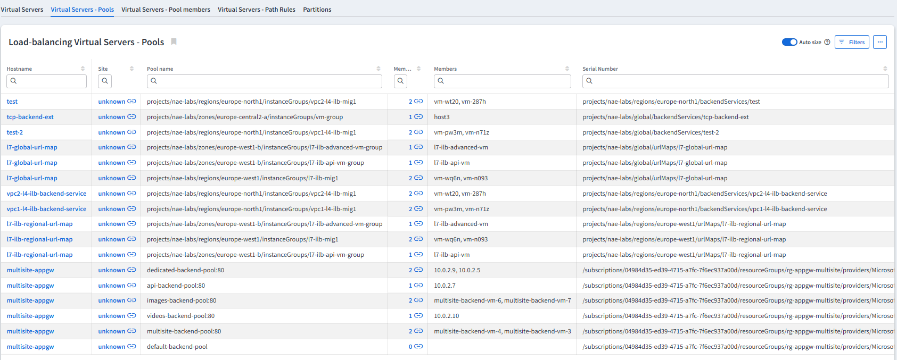
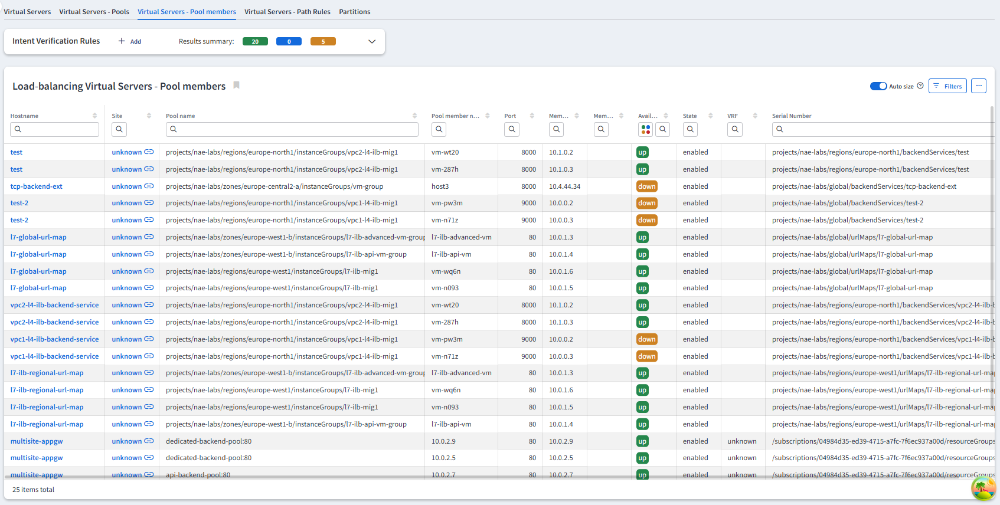
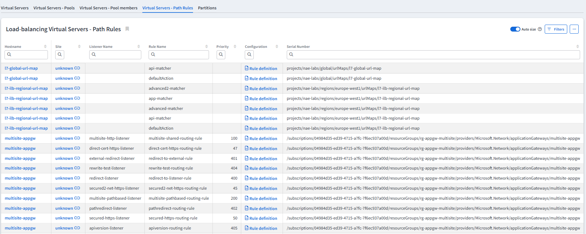
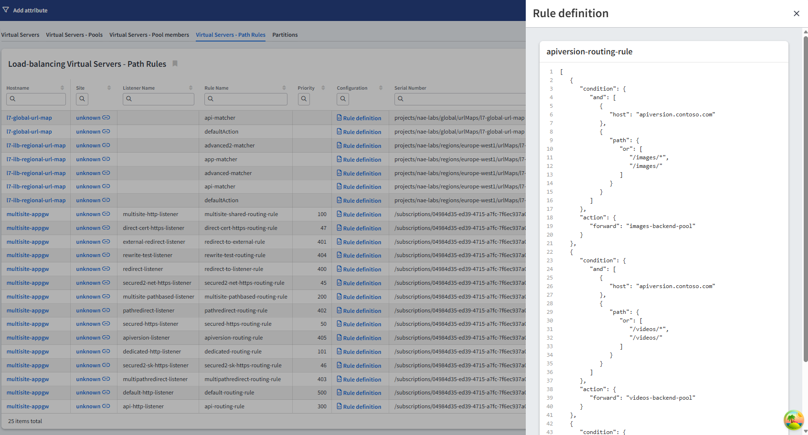

# Load Balancing

The Load Balancing section provides information about load balancing configurations on the network.

## Virtual Servers

The **Virtual Servers** table displays load balancer configuration details, including virtual server names, virtual IP addresses (VIPs), availability states, and associated pools. 
Each entry shows port and protocol details, pool membership counts, and advanced settings like source NAT and VRF assignments.

## Virtual Servers - Pools

The **Virtual Servers - Pools** table provides detailed information about backend pools associated with each load balancer. 
It displays pool names, member counts, and individual pool members by hostname or IP address.

## Virtual Servers - Pool Members

The **Virtual Servers - Pool Members** table shows individual pool member details, including backend endpoints such as VMs or FQDNs.
It displays member names, IP addresses (both IPv4 and IPv6), port numbers, and operational status, including availability (up/down) and state (enabled/disabled).

## Virtual Servers - Path Rules

The **Virtual Servers - Path Rules** table displays HTTP/HTTPS routing rules configured on application load balancers, including listener names, rule names, and priority values that determine rule processing order. Each entry shows the rule configuration with details about URL path matching, host-based routing, and traffic forwarding actions.

## Virtual Servers - Partitions

The **Virtual Servers - Partitions** table displays partition names and descriptions.
