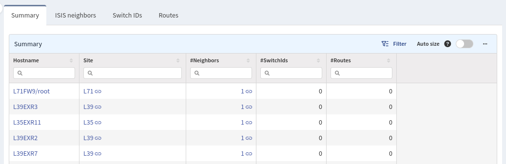
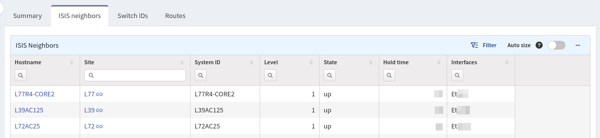
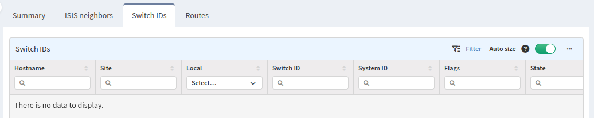
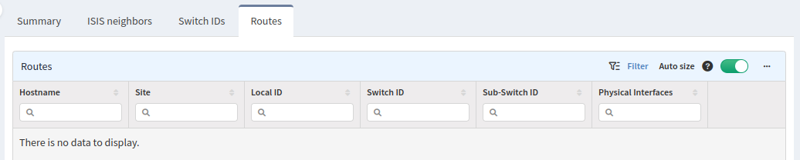

# Cisco FabricPath

The **Cisco FabricPath** section contains information about summaries,
neighbors, switch identifications, and routes.

## Summary

The **Summary** tab contains the summary of neighbors, switch IDs and routes.

## IS-IS Neighbors

The **IS-IS neighbors** tab contains information about adjacency of devices that
are contributing in FabricPath.

## Switch IDs

The **Switch IDs** tab contains information about a list of Switch IDs that the
current device knows about.

## Routes

The **Routes** tab contains information about routes from the specific device
contributing in FabricPath.

