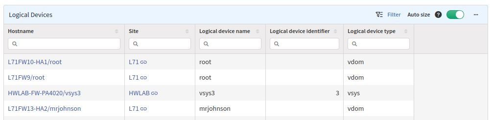

# Logical Devices

The **Logical Devices** section provides a summary of all discovered logical
firewalls (contexts, VSYS, VDOM) and Cisco Nexus VDCs. For each logical device,
it provides its name and type and if available even its ID.

