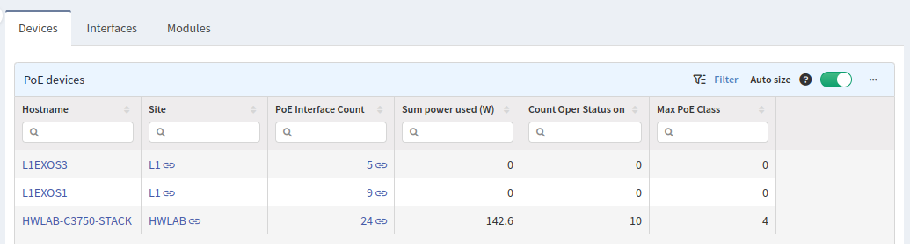
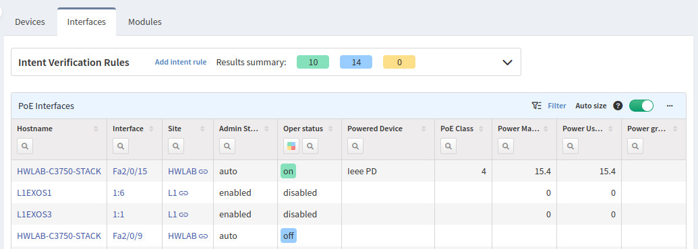
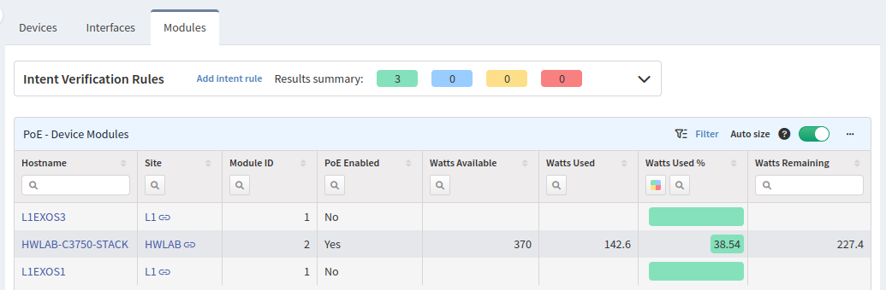

# PoE

Useful information about power consumption over the PoE protocol can be found in
this section.

## Devices

The **Devices** tab displays all devices that support the PoE protocol, the number of PoE
interfaces, current power usage, the number of ports that uses PoE, and highest PoE
class available on the device

## Interfaces

The **Interfaces** tab lists all interfaces that support the PoE protocol. Filters
can be used to check the PoE interface status on a particular device. The `Admin
status` column shows the administrative status of an interface; it can be
`enabled`, `auto`, `admin-down`, `shutdown`, or `disabled`. The `Oper status` column lists the
status of every enabled PoE port. The type/PID of powered devices are available in
the `Powered Device` column, if available. The last four columns describe PoE
class and power usage.

## Modules

The **Modules** tab shows the PoE module statistics. This table is especially
significant because it shows the used power consumption in watts, percentage, and how
many watts are left.

