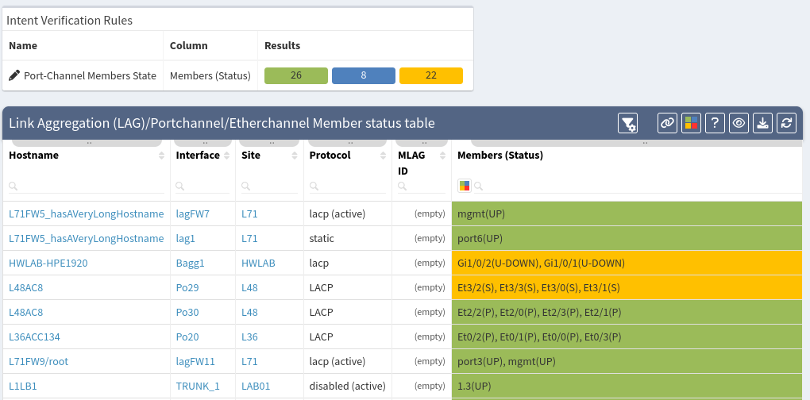
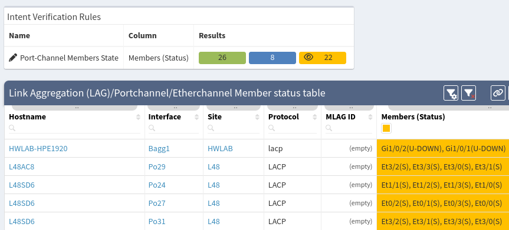

# Port-Channels

The Port-channels section covers information about port channels, which
combine multiple physical links for load sharing and redundancy
purposes. The section provides information about discovered channels and
their members, alongside current rates and balancing ratios.

As an example, let's have a look at the **Member status table**.

IP Fabric has a lot predefined intent rules. In our particular case port channels are colored green if everything is OK and other color is used when some malfunction are detected.

You can also filter colors by clicking them above in **Intent Verfication Rules** box. When clicked, small eye icon is displayed and items are filtered only to the selected color. Click again to the same color to clear filter.

