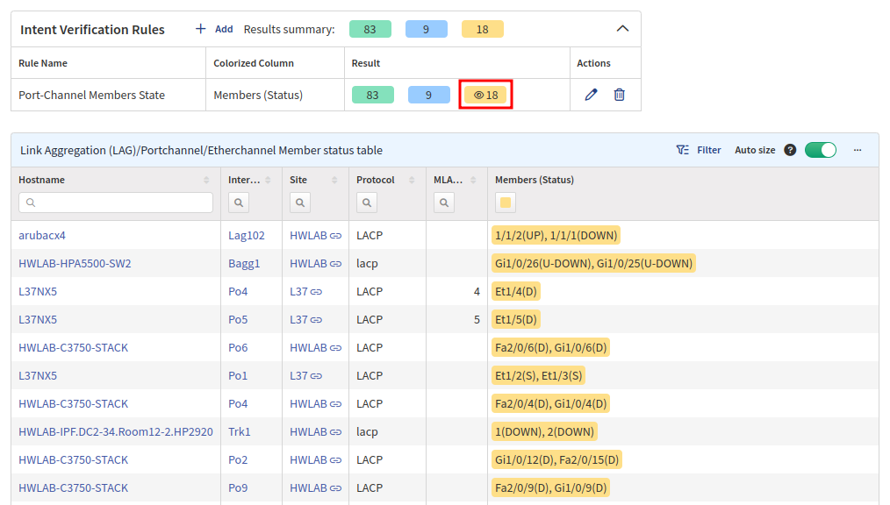

# Port Channels

The **Port channels** section covers information about port channels, which
combine multiple physical links for load sharing and redundancy
purposes. The section provides information about discovered channels and
their members, alongside current rates and balancing ratios.

As an example, let's take a look at the **Member status table**.

IP Fabric has many predefined intent rules. In our particular case, port channels are colored green if everything is OK, and another color is used when some malfunctions are detected.

You can also filter colors by clicking them in the **Intent Verification Rules** box above. When clicked, a small **eye** icon is displayed, and items are filtered only to the selected color. Click the same color again to clear the filter.

