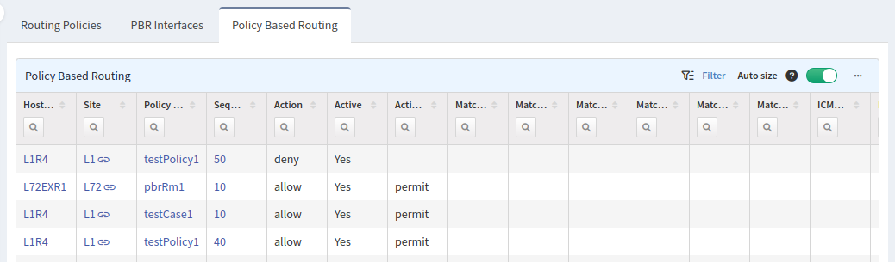

# Routing

## Prefix Lists

Prefix lists section contains definitions of all prefix lists. There are 2 tabs according to address family -- IPv4 and IPv6

## Routing policy

This section contains information about routing policies, their definitions and where they are applied.

There are 3 tabs -- Routing Policies, PBR Interfaces and Policy Based Routing.

### Routing Policies

Routing Policies tab contains definition of routing policies, their names, sequence numbers, matching conditions, set actions etc.

In case match condition uses reference to ACL or Prefix list, it is a hyperlink to appropriate ACL/Prefix list in its section.

### PBR Interfaces

PBR Interfaces tab contains information about interfaces which have assigned some routing policy on them (used for policy based routing). Optionally there is also information about used address-family or status of routing policy.

### Policy Based Routing

Policy Based Routing (PBR) tab contains matching conditions for traffic and what actions should be applied on packets that match those conditions. All PBR actions are present in a PBR Actions column.

In case match condition uses reference to ACL, it is a hyperlink to appropriate ACL list in its section.

Clicking on Policy Name opens tree view.

Policy based routing rules are now also applied for packets in end-to-end path diagrams.

Selecting PBR's name in a decision table opens a tree view with the highlighted rule that matched the packet and decided that the PBR action should be applied.

!!! Note

	Currently are supported only IP based policy based routing nexthops.

