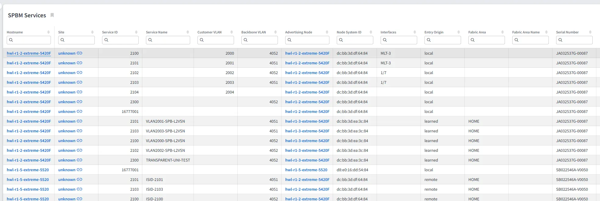
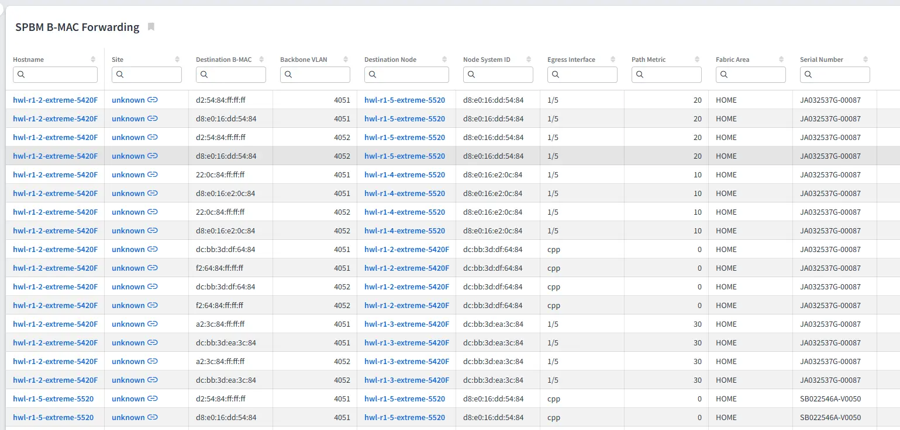

# Shortest Path Bridging MAC (SPBM)

Shortest Path Bridging MAC mode (SPBM), defined in **IEEE 802.1aq**, is a Layer 2 fabric technology. It uses **IS-IS** as its control plane to build loop-free, shortest-path forwarding across the backbone. SPBM encapsulates customer traffic in a backbone MAC (**MAC-in-MAC**, 802.1ah) header. It forwards traffic between fabric nodes based on their **backbone MAC (B-MAC)** addresses.

A **Service Instance Identifier (I-SID)**, a 24-bit value, identifies services and maps customer traffic to a specific service across the fabric. A **backbone VLAN (B-VLAN)** carries the encapsulated traffic for each I-SID.

## Key Concepts

- **B-MAC (Backbone MAC)** -- The MAC address that identifies a fabric node in
  the backbone. SPBM unicast forwarding is performed toward destination B-MACs.
- **I-SID (Service Instance Identifier)** -- A 24-bit service identifier that
  uniquely represents a service instance across the fabric.
- **B-VLAN (Backbone VLAN)** -- The VLAN used to transport the encapsulated
  backbone traffic between fabric nodes.
- **Node System ID** -- The IS-IS system ID (a MAC address) that identifies a
  fabric node in the SPBM control plane.
- **Fabric Area** -- The fabric area classification of an entry, either `HOME`
  (the local fabric area) or `REMOTE` (reachable through another area).

## Tabs in Technology --> SPBM

The **SPBM** section has two tabs: **Services** and **B-MAC Forwarding**.

### Services

The **Services** tab lists the I-SID service entries distributed by IS-IS across the fabric. Each entry maps an I-SID to a backbone VLAN and records the fabric node advertising the service. It also records the local access interfaces (SAPs) bound to it. The `Entry Origin` column indicates whether the entry is `local` (this device is the advertising node), `learned` (advertised by another fabric node but also configured locally on this device), or `remote` (advertised by another fabric node and not configured locally).

| Column | Description |
| --- | --- |
| Hostname | Device hostname from which IP Fabric collected the SPBM service data. |
| Site | Device site location. |
| Service ID | I-SID service identifier. |
| Service Name | Name associated with the I-SID service. |
| Customer VLAN | Customer VLAN mapped to the I-SID. |
| Backbone VLAN | Backbone VLAN used by the SPBM service. |
| Advertising Node | Hostname of the fabric node advertising this service entry. Links to the device when it exists in the snapshot. |
| Node System ID | System ID (MAC address) of the advertising node. |
| Interfaces | Local access interfaces (SAPs) bound to this I-SID on the advertising node. |
| Entry Origin | Origin of the service entry: `local` (this device is the advertising node), `learned` (advertised by another node and also configured locally here), or `remote` (advertised by another node, not configured locally). |
| Fabric Area | Fabric area classification (`HOME` or `REMOTE`). |
| Fabric Area Name | Fabric area name reported by the device. |

### B-MAC Forwarding

The **B-MAC Forwarding** tab displays the SPBM underlay unicast forwarding entries toward destination backbone MAC addresses. Each entry records the destination B-MAC and the backbone VLAN. It also records the fabric node that owns the destination, the egress interface used to reach it, and the associated path metric (cost).

| Column | Description |
| --- | --- |
| Hostname | Device hostname from which IP Fabric collected the B-MAC forwarding data. |
| Site | Device site location. |
| Destination B-MAC | Destination backbone MAC address reachable in the underlay. |
| Backbone VLAN | Backbone VLAN used for the underlay forwarding entry. |
| Destination Node | Hostname of the fabric node that owns or advertises the destination. Links to the device when it exists in the snapshot. |
| Node System ID | System ID (MAC address) of the destination fabric node. |
| Egress Interface | Egress interface used to reach the destination B-MAC. |
| Path Metric | Path metric (cost) associated with the forwarding entry. |
| Fabric Area | Fabric area classification (`HOME` or `REMOTE`). |

## Vendor Support

SPBM data collection is currently supported on the following platforms:

- **Extreme Networks VOSS**
- **Alcatel-Lucent Enterprise AOS / OmniSwitch**

See the [Feature Matrix](https://matrix.ipfabric.io/) for the most up-to-date
list of supported vendors and features.
