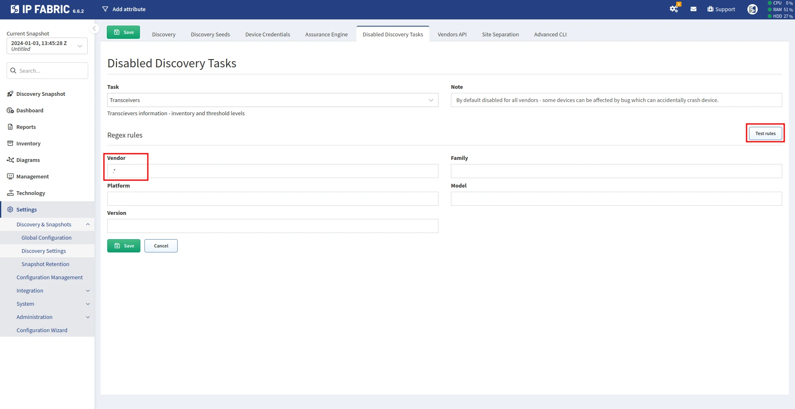

# Transceivers

## Transceivers Task

Executing certain commands to obtain transceiver-related information may cause
issues on some devices. In the worst case scenario, a device may crash and
reload. To prevent disruptions to your network, IP Fabric uses a transceiver
task execution control system. The task is only executed on a device if:

- The transceiver task is enabled.

- IP Fabric doesn't classify the device to be affected by any known bug.

Notes:

- The transceiver task is disabled by default. You may enable it in the IP Fabric
  settings (see the steps below).

- Even if the transceiver task is enabled, IP Fabric still prevents its
  execution on any device that is classified to be affected by any
  known bug. It is not possible to disable this feature now. See the
  list of known bugs and their corresponding software and hardware
  versions.

!!! note

    Although we try to prevent task execution on all software and hardware
    versions that are known to be affected by any bug, we cannot guarantee
    that all bugs are patched. For example, a device manufacturer may update
    their list of devices affected by a certain bug in time, but the IP Fabric
    system may not fully reflect it.

## How To Find Transceivers in IP Fabric

Navigate to **Technology --> Interfaces --> Transceivers**.

## How To Enable/Disable Transceivers Task

This function is **enabled by default** for all vendors and product
families. This means that **this command is not executed on any
device**.

The function can be **enabled/disabled** in **Settings --> Discovery & Snapshots
--> Discovery Settings --> Disabled Discovery Tasks**.

To **disable** this task, you need to **delete the default Transceivers
task** or **edit** it.

When **editing** the task, you select devices on which this command **should
not** be executed using a regex expression. For example, if you
don't want to run the `show interface transceivers` command on any Cisco
devices, put `cisco` in the **Vendor** field. More specific device selection
can be done by the **Family**, **Platform**, **Model**, and **Version** fields.
You can test your regex rules with the **Test rules** button.

