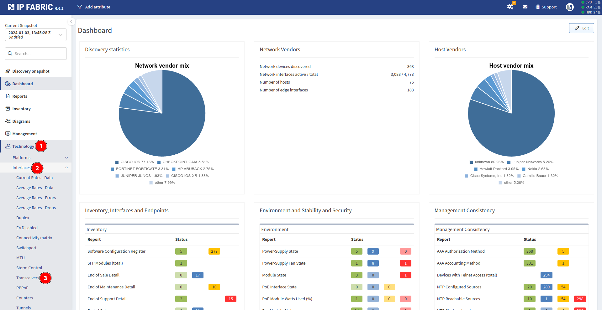
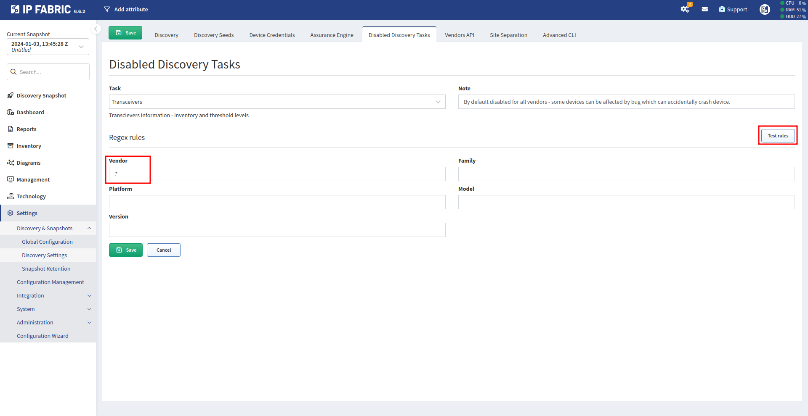

# Transceivers

## Transceivers Task

Executing some commands to get transceiver related information may cause
issues on some devices. In the worst case, a device may crash and
reload. To prevent disruptions of your network, IPF uses a transceiver
task execution control system. The task is only executed on a device if

- The transceiver task is enabled

- IPF doesn’t classify the device to be affected by any known bug

Notes:

- Transceiver task is disabled by default. A user can enable it in IPF
  settings (see the steps below).

- Even if the transceiver task is enabled, IPF still prevents its
  execution on any device that is classified to be affected by any
  known bug. It is not possible to disable this feature now. See the
  list of known bugs and their corresponding software and hardware
  versions.

!!! note
    Although we try to prevent task execution on all software and hardware
    versions that are known to be affected by any bug, we cannot guarantee
    that all bugs are patched. For example, a device manufacturer may update
    their list of devices affected by a certain bug in time, but IP Fabric
    system may not fully reflect it.

## How To Find Transceivers In IP Fabric

Navigate to **Technology → Interfaces → Transceivers**.

## How To Enable/Disable Transceivers Task

This function is **enabled by default** for all vendors and product
families. This means that **this command is not executed on any
device**.

The function can be **Enabled/Disabled** in section **Settings →
Advanced → Discovery task**.

To **disable** this task, you need to **delete the default Transceivers
task** or **edit** this default task.

When **editing** this rule, you select by regex expression on which
devices this command **should not** be executed (so for example if you
don't want to run show interface transceivers command for all CISCO
devices, put cisco to the Vendor field. More specific device selection
can be done by Family, Platform, Model and Version fields). You can
simply test your Regex rules by **Test rules** button.

