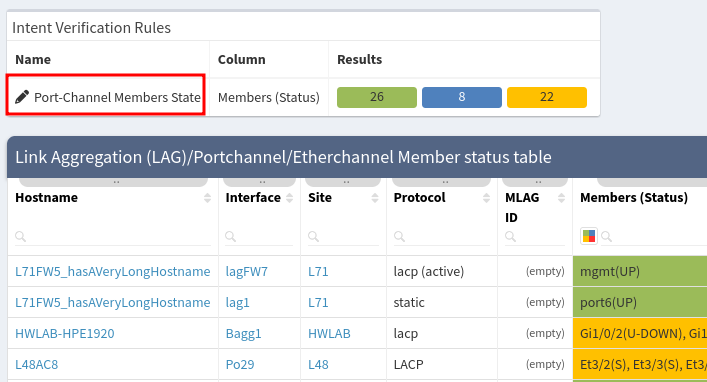
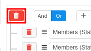
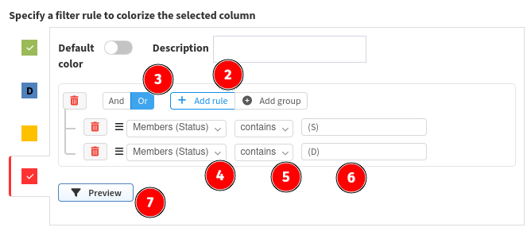
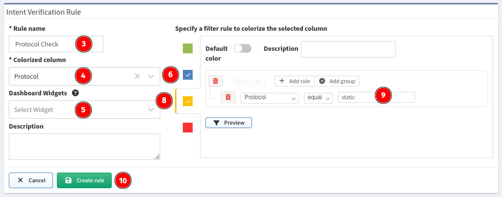

# Intent Verification Rule

## Edit Intent Verification Rule

Intent verification coloring rules can be fully customized. To do that click on the pencil next to the rule name in the box above the technology table, which is **Port-Channel Members State** in our case.

Now you can check and change predefined colorization rules.

Let's change coloring from blue to red when port in port-channel is
down:

1. Remove rules from blue color. Click on blue color and then trash
   icon:  
    
2. Click to red color and **Add rule**.
3. Select logical **OR** because we want mark member red if any of
   defined rules apply.
4. We are interested in **Members (Status)** table row.
5. We would like to check if this row **contains** specific string.
6. Specify string we are looking for like **(D)** or **(DOWN)**  
   
7. Click **Preview** to see if you rule works
8. If you are satisfied with the result click **Update rule**.

You can also add new set of coloring rules. For example, if you want to check the aggregation protocol used.

## Create Intent Verification Rule

Let's take an example using the Port Channels > Member status table.

1. Go to **Technology --> Port Channels --> Member status table**.
2. Click to **Intent Verification Rules** button in the right toolbox menu.  
   
3. Specify **Rule name**, for example **Check protocol**.
4. Select **Colorized column**, it's **Protocol** in our case.
5. Leave **Widgets** empty for now.
6. Click on **blue**.
7. Create rule **Protocol insensitive equal `lacp`**
8. Click on **yellow**.
9. Create rule **Protocol equal static**.
10. Click **Create rule**.  
    
