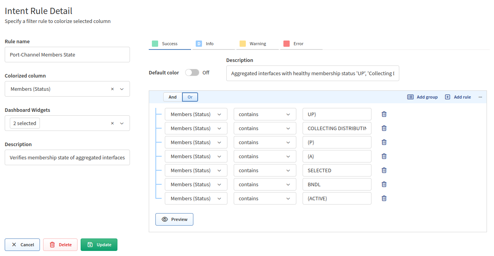
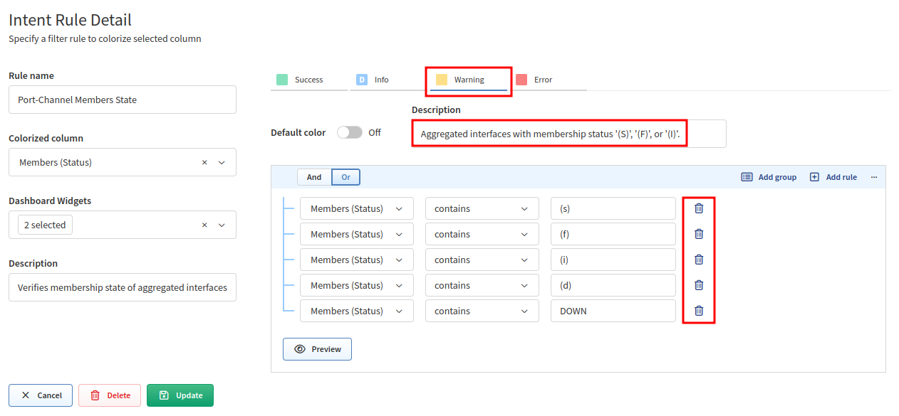
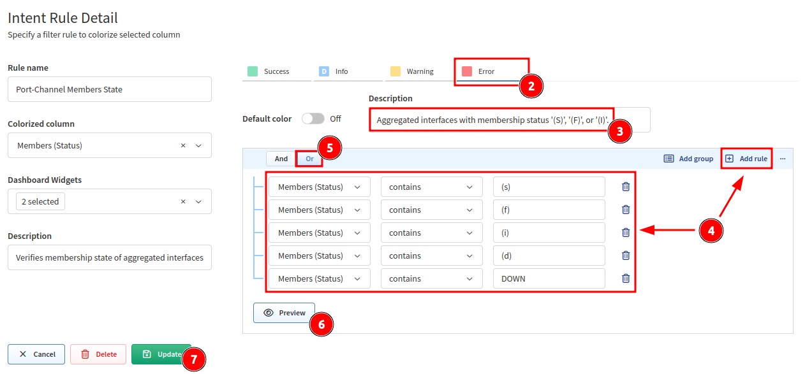
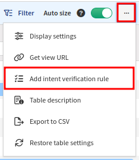
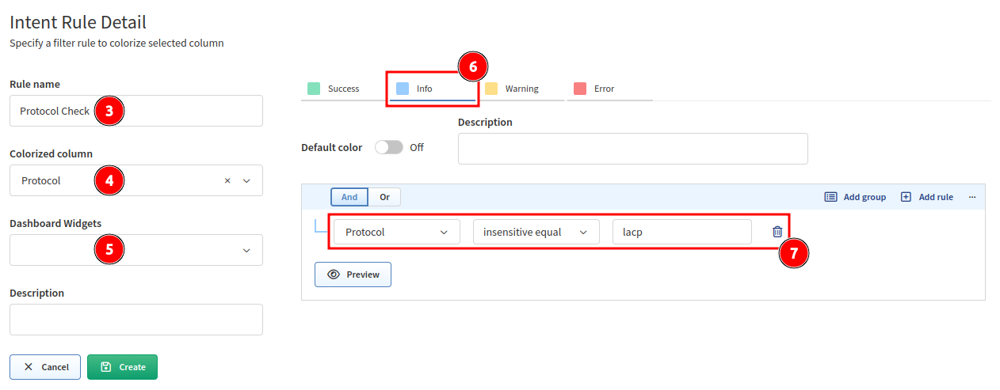
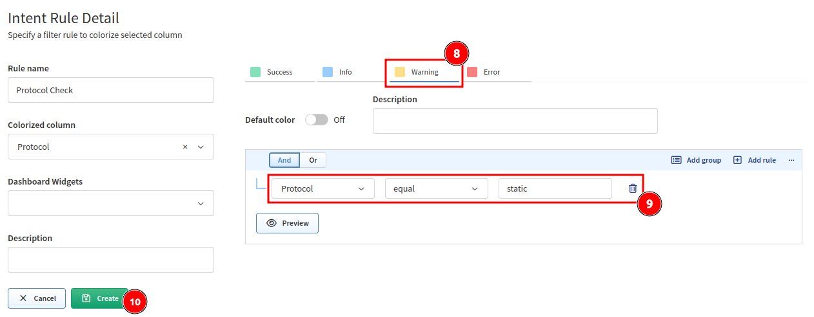

# Intent Verification Rules

## Edit Intent Verification Rule

Intent verification coloring rules can be fully customized. To do that, click
the **Pencil** icon next to a rule in the **Intent Verification Rules** box
above a technology table.

In our example, we will use the **Port-Channel Members State** rule above the
**Link Aggregation (LAG)/Portchannel/Etherchannel Member status table** (in
**Technology --> Port channels --> Member status table**).

Now we can check and change the predefined coloring rules:

Let's change the coloring from amber to red for `Aggregated interfaces with
membership status '(S)', '(F)', or '(I)'.`:

1. Remove rules from the amber color. Click the **amber color** and then the
   **Trash** icon next to each rule (the **Description** can be also removed):  
   
2. Click the **red color**.
3. Set the **Description** to `Aggregated interfaces with membership status
   '(S)', '(F)', or '(I)'.`
4. Use **+ Add rule** to add each of these rules regarding the `Member (Status)`
   column:
   - "`Members (Status)` contains `(s)`"
   - "`Members (Status)` contains `(f)`"
   - "`Members (Status)` contains `(i)`"
   - "`Members (Status)` contains `(d)`"
   - "`Members (Status)` contains `(DOWN)`"
5. Select logical `Or` because we want to mark a member red if any of the
   defined rules apply.
6. Click **Preview** to see if the rule works.
7. If it works as expected, click **Update**.
   

## Create Intent Verification Rule

You can also add a new set of coloring rules.

For example, if you want to check the aggregation protocol used in the **Link
Aggregation (LAG)/Portchannel/Etherchannel Member status table**:

1. Go to **Technology --> Port channels --> Member status table**.
2. Click `...` in the top-right corner of the table and select `Add intent
   verification rule`:  
   
3. Specify the **Rule name**. For example, `Protocol Check`.
4. Select **Colorized column**. In our case, it's `Protocol`.
5. Leave **Dashboard Widgets** empty for now.
6. Click the **blue color**.
7. Create a rule "`Protocol` insensitive equal `lacp`".
   
8. Click the **amber color**.
9. Create a rule "`Protocol` equal `static`".
10. Click **Create**.  
    
