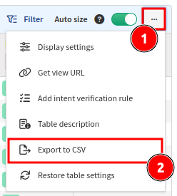
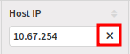
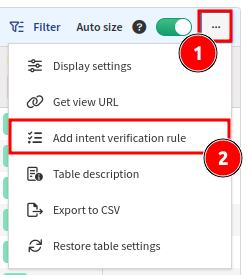

# Navigate in Tables

## Tables

Tables allow for analysis and correlation of network state information and
parameters on the fly. Most of the tables display live snapshot data generated
by graph algorithms without pre-existing cache. The first load of a table
usually takes longer than subsequent loads, but all tables were built to handle
a large capacity and complex queries, so the outcome should be better than
analyzing the output in an external application like Excel.

## Working With Tables

As an example, the **ARP Table** (in **Technology --> Addressing --> ARP Table**)
is used below to demonstrate the functionality of tables.

### Table Description

By clicking `...` (the 3-dot button in the top-right corner of the table) and
selecting `Table description`, you can get a short description of the current
table along with API examples.

### Export to CSV

The current table view can be exported to CSV. This is useful for additional
data processing in an external application.

### Contextual Help

Contextual help (tooltip) is displayed when the mouse cursor hovers over a table
header text or a table icon.

### Searching for Data

Filters will change what is displayed in the table, the exported CSV data, and
the API documentation found in the [Table Description](#table-description).

#### Simple Filtering

In most columns, you can type in what you are looking for. The example above
shows a search for all devices with an IP address starting with `10.67.254`
throughout all the ARP tables in our lab environment.

Use this button to clear the filter:

#### Advanced Filtering

If you need a more precise filter, use `Advanced Filter`.

Filters are defined by groups and rules. Each group can contain one or more
rules or another group. There is always one root group which cannot be deleted
(group 1). Select the logical operator for each group. The example above shows
logical `Or` for group 1 and logical `And` for groups 2 and 3.

What does the example above do? It shows all devices with hostname `L47AC8` AND
interface `Et7/2` as well as devices with hostname `L43SD73` AND interface
`Et13/0`. In other words: "Show all devices with hostname `L47AC8` which have
interface `Et7/2`, plus all devices with hostname `L43SD73` with interface
`Et13/0`.

### Using the Standard Metric Notation on Filtering

When filtering values in number columns using `Simple Filtering` or in the `Advanced Filters`, you can type not only numbers but also some measure prefixes (like `10k`, `15M`, etc.):

or

These are the available prefixes:

| **Symbol** | **Name** | **Base 10** | **Decimal**      |
| ---------- | -------- | ----------- | ---------------- |
| `P`        | `peta`   | 10^15^      | 1000000000000000 |
| `T`        | `tera`   | 10^12^      | 1000000000000    |
| `G`        | `giga`   | 10^9^       | 1000000000       |
| `M`        | `mega`   | 10^6^       | 1000000          |
| `k`        | `kilo`   | 10^3^       | 1000             |

### Share Table View

The table view can be shared with other users.

### Intent Verification Rules (Colorizing Columns)

The table column can be colored based on pre-defined rules. The existing (as
well as the default) rules are visible above the table and can be edited or
removed.

To create a new rule, you need to specify its `Rule name` and select a
`Colorized column`. Adding the rule to a `dashboard widget` will enable it to be
displayed on the **Dashboard**, but this is optional (check the
[Dashboard](../../IP_Fabric_GUI/dashboard.md) page for more details).

Finally, specify a filter rule to color the selected column:

1. Choose a color to apply rules to.
2. Add rules based on the same logic as described in
   [Advanced Filtering](#advanced-filtering).
3. A color can be designated as the `Default color`, meaning it will be used if
   no other rules are matched.
4. Click **Update rule** or **Create rule** to save your changes.

In the example above, all items in the `VRF` column which are named `VRF1` will
be colored red. A summary number of items which match this rule will also be
displayed in the `Interfaces` widget on the **Dashboard**.

### Display Settings

In `Display Settings`, you may select what columns are displayed. This will also
change the behavior of [Export to CSV](#export-to-csv) and the API documentation
in the [Table Description](#table-description).

### Auto Size

`Auto size` (enabled by default) ensures that columns are automatically sized to
fit their current content each time the table is opened.

By disabling `Auto size`, columns will remember user-defined widths.

### Restore Table Settings

Table filters and other settings can be restored using the `Restore table
settings` option. Coloring rules will not be removed!
