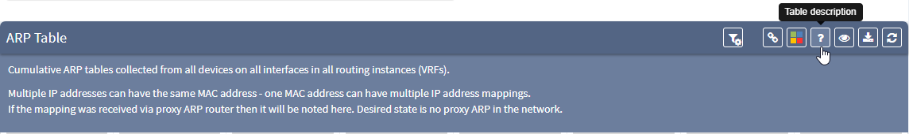
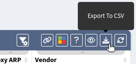
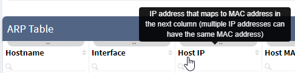
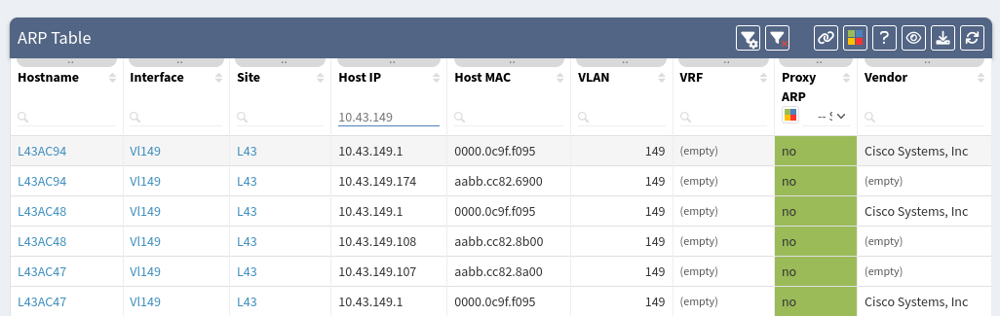
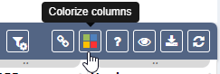
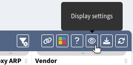
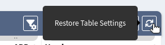

# Navigate in Tables

## Tables

Tables allow for analysis and correlation of network state information and parameters on the fly. Most of the tables display live snapshot data generated by graph algorithms without preexisting cache. The first load of a table usually
takes longer than subsequent loads, but all tables were built to handle a large capacity and complex queries, so the outcome should be better than analyzing the output in an external application like Excel.

## Working with tables

*The ARP technology table is used as an example below to demonstrate the functionality of tables.*

### Table Description

You can get a short description of the current table along with API examples via question mark button.

### Export to CSV

The current table view can be exported to CSV. This is useful for additional data processing in an external application.

### Contextual Help

Contextual help (tooltip) is displayed when a mouse cursor hovers over a table icon or table header text.

### Searching for Data

When using filters this will change what is displayed in the table, the exported CSV data, and the API documentation found in the [Table Description](#table-description).

####  Simple Filtering

Type in what you are looking for in most columns. The example above shows a search for all devices with an IP address starting "10.41.133" throughout all the ARP tables in our infrastructure. Use the below button to clear the search
results.

#### Advanced Filtering

If you need a more precise filter use `Advanced Filter`.

Filters are defined by groups and rules. Each group can contain on or more rules or another group. There is always one root group which cannot be deleted (number 1). Select the logical operator for each group. The example above shows
logical Or for the first group and logical And for groups two and three.

What does example above do? It shows all devices with hostname `L47AC8`
AND interface `Et7/2` as well as devices with hostname `L43SD73` AND interface `Et13/0`. In other words: "Show me all devices with hostname `L47AC8` which have interface `Et7/2`, plus all devices with hostname `L43SD73` with interface
`Et13/0`.

### Share Table View

The table view can be shared with other users.

### Intent Verification Rules (Colorizing Columns)

The table column can be colored based on predefined rules. Existing (as well as default rules) are visible above table and can be edited or removed.

To create a new rule, you need to specify `Rule name` and select the `Colorized column`.  Adding the rule to a `Dashboard Widget` will enable it to be displayed in the Dashboard, but is not required
(check [Dashboard documentation](../../IP_Fabric_GUI/dashboard.md) for more details).

Finally, specify a filter rule to colorize the selected column:

1. Choose the color to apply rules to.
2. Add rules based on the same logic as described in [Advanced Filtering](#advanced-filtering).
3. A color can be designated as a `Default color` which means that it will be used if it does not match any other rules.
4. Click `Update rule` or `Create rule` to save your changes.

In the example above, all items in the `VRF` column which are named `vrf4` will be colored red. A summary number of items which matches this rule will also be displayed on Dashboard in the `Interfaces` widget.

### Display setting

Select what columns are displayed by choosing in `Display settings`.  This will also change the behavior of the CSV output and the API documentation in the [Table Description](#table-description).

Enable `Sticky first column` to fix the first column in case of horizontal scrolling.

Enable `Sticky table header` to fix the table header in case of vertical scrolling.

Tables' rows and text can be adjusted to small, medium or large sizes with `Rows height adjust`.

### Restore table setting

Table filters and other settings can be restored using the `Restore Table Settings` button. Colorization rules are not removed!
