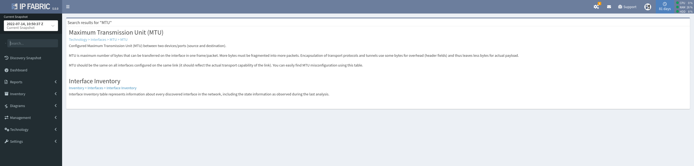

# Searching

The user interface includes numerous views which cover a range of technologies. To find a specific page or technology table, use the **Search** bar located in the left panel.

IP Fabric provides a quick navigation to its technology tables rather than supporting full-text search for all database values. For example, the search does not return results for `1500`, but searching for `MTU` will return the appropriate technology view, which can be then filtered for specific MTU values. Similarly, the search will not return results for an IP address, however looking for hosts, endpoints or devices first will point to the right technology view, which can be then filtered for a specific search intent.

