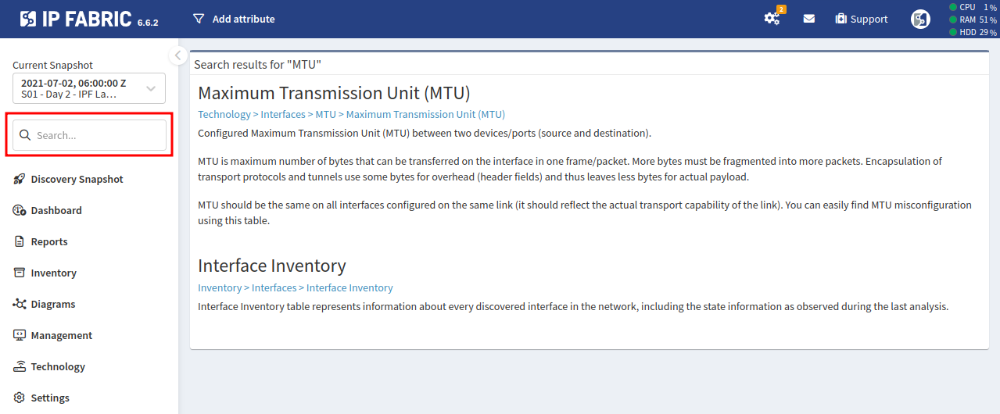

# Searching

The user interface includes numerous views which cover a range of technologies. To find a specific page or a technology table, use the Search function located in the top ribbon.

IP Fabric provides quick navigation for its technology tables rather than supporting a full-text search for all database values. For example, the search does not return results for "1500", but searching for "MTU" will return the appropriate technology view, which can then be filtered for specific MTU values. Similarly, the search will not return results for an IP address, however first looking for hosts or endpoints or devices will point to the right technology view, which can then be filtered for specific search intent.

