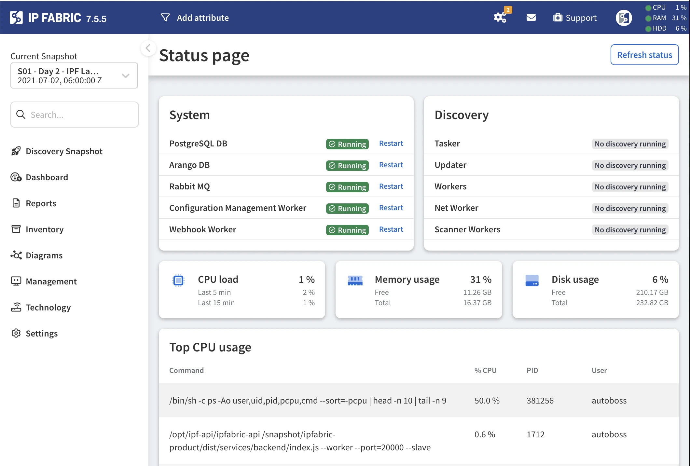

# System Status

By clicking the CPU/RAM/HDD status located in the top right corner
of the primary GUI, you will be redirected to the **System status** section.
This section provides comprehensive information, including the current CPU
load, RAM utilization, disk space consumption, and the status of currently
running services.

The most CPU-intensive system processes are also displayed.

!!! info

    When no discovery process is running, its services (`Tasker`, `Updater`,
    `Workers`, `Net Worker`, and `Scanner Workers`) are expected to be inactive.
