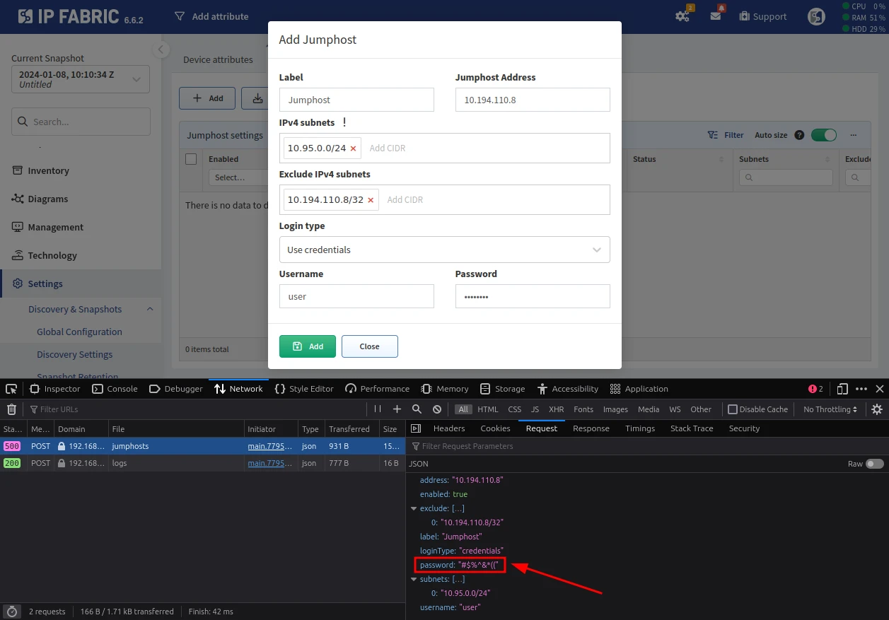

# Troubleshooting Vague Messages

IP Fabric error messages are not always eloquent, and vague ones like `Invalid
Input` can be displayed:

If you are unsure about what exactly went wrong, you can get more descriptive
messages from API responses received in the background.

These messages can be found in the developer console of your browser.

In your browser, press `F12` or click the hamburger menu in the top-right corner
and go to **More tools --> Web Developer Tools**. Something similar should
appear:

!!! info

    The console may look different in your browser, but the functionality and
    tabs should be the same. This example is from Mozilla Firefox.

Go to the `Network` tab and repeat the action which raised the error message;
API calls should appear in the tab.

After clicking a response from IP Fabric with an error code (usually the ones in
red color), go to the `Response` tab, and in the `errors` section, you should
find an explanation of why the `Invalid Input` message appeared:

!!! example

    In our example, the error message was thrown because restricted characters
    were present in the jumphost's `Password` field:

    
