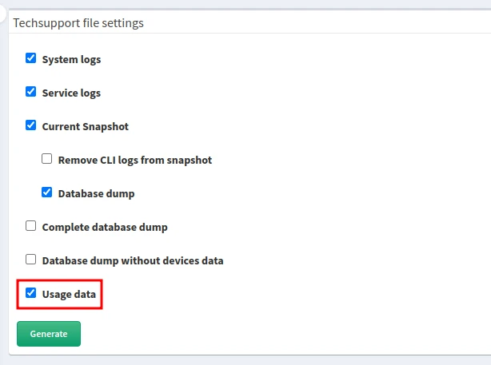

# Usage Data Collection

Starting with version `6.7`, IP Fabric collects usage data to help improve the
product. We use [PostHog](https://posthog.com) as a client-side event library.

We collect only anonymous data not bound to any personal information like names,
emails, etc. The data describe the user environment (browser, operating system,
window size, etc.) and user interactions with the application (clicks, page
views, etc.).

The data are collected locally on your IP Fabric instance. Usage data will be
included in the Techsupport file unless you opt out when selecting what to
include in the Techsupport file.

