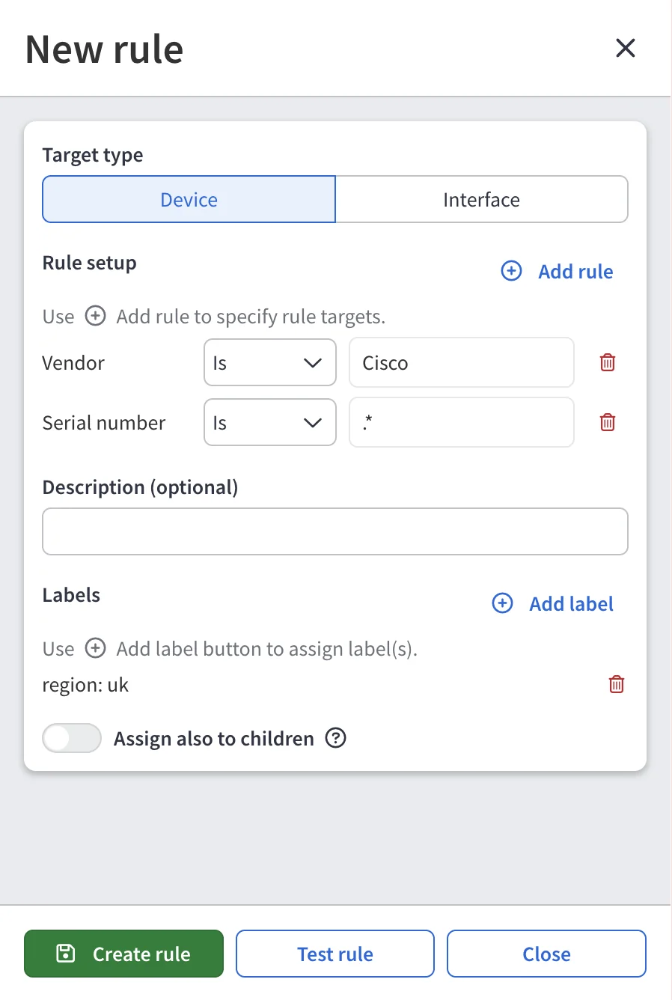
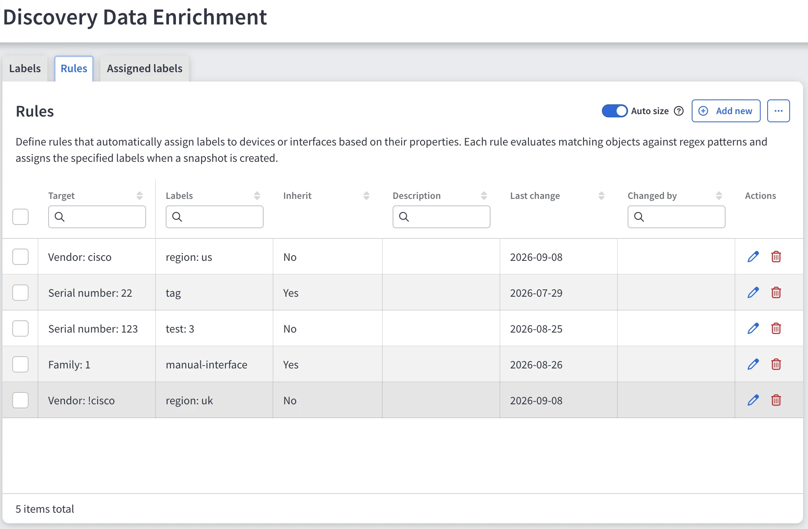

# Automatic Assignment Rules

--8<-- "snippets/labels_experimental.md"

Rules apply labels to every device that matches a set of conditions, so you do
not have to assign labels manually as the network changes.

## Create a Rule

1. Navigate to **Settings --> Discovery & Snapshots --> Discovery Data Enrichment -->
   Rules** and click **+ Add new**.
2. In **Rule setup**, click **+ Add rule** to add one or more conditions. Each
   condition consists of a device property, an operator, and a regular
   expression.
3. (Optional) Add a description of up to 256 characters.
4. In **Labels**, click **+ Add label** to add the labels the rule assigns. A
   rule needs at least one label.
5. (Optional) Enable **Assign also to children**, so matching devices also
   pass their labels to their L2 interfaces.
6. Click **Test rule** to see which devices the conditions currently match.
7. Click **Create rule**.

## Properties and Operators

A condition can use the following device properties:

- Hostname
- Vendor
- Family
- Model
- Platform
- Version
- Serial number

Each property supports two operators, and both match the value as a regular
expression, not as an exact string:

- **Is** -- The property matches the regular expression. For example,
  **Hostname** is `^par-` matches every hostname starting with `par-`.
- **Is not** -- The property does not match the regular expression. For
  example, **Model** is not `^C9[0-9]{3}` excludes Catalyst 9000 models.

To match the entire value instead of a part of it, anchor the expression with
`^` and `$`. For example, **Hostname** is `^par-core-01$` matches only the
hostname `par-core-01`, but not `par-core-01-old`.

Each property appears only once per rule. IP Fabric combines conditions with
`AND` -- a device must match all of them. IP Fabric validates the regular
expression when you save the rule.

!!! example

    A rule has two conditions -- **Hostname** is `^par-` and **Vendor** is
    `cisco` -- and assigns `region:EMEA` and `site:paris`, with inheritance
    turned on.

    Every Cisco device whose hostname starts with `par-` receives both labels,
    and so does each of its L2 interfaces.

## When a Rule Takes Effect

IP Fabric evaluates rules during the label calculation that follows discovery.
Saving a rule does not relabel existing snapshots.

## Tracing a Label Back to Its Rule

The **Rules** tab lists each rule's target conditions, assigned labels,
inheritance status, description, last-changed date, and last-changed user.
Click the icons in the **Actions** column to edit or remove a rule.

In the **Assigned labels** tab and in the **Labels** tab of
[Device Explorer](create_and_assign_labels.md#edit-labels-in-device-explorer),
a rule-produced assignment links back to the rule that produced it.
