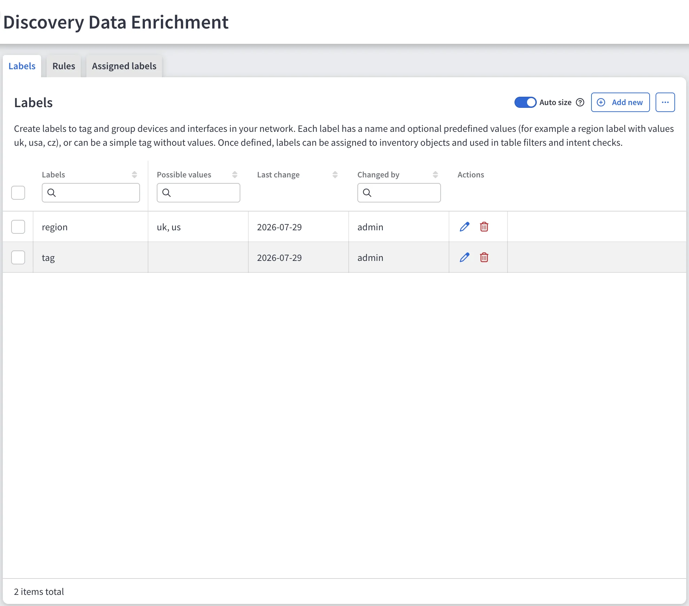
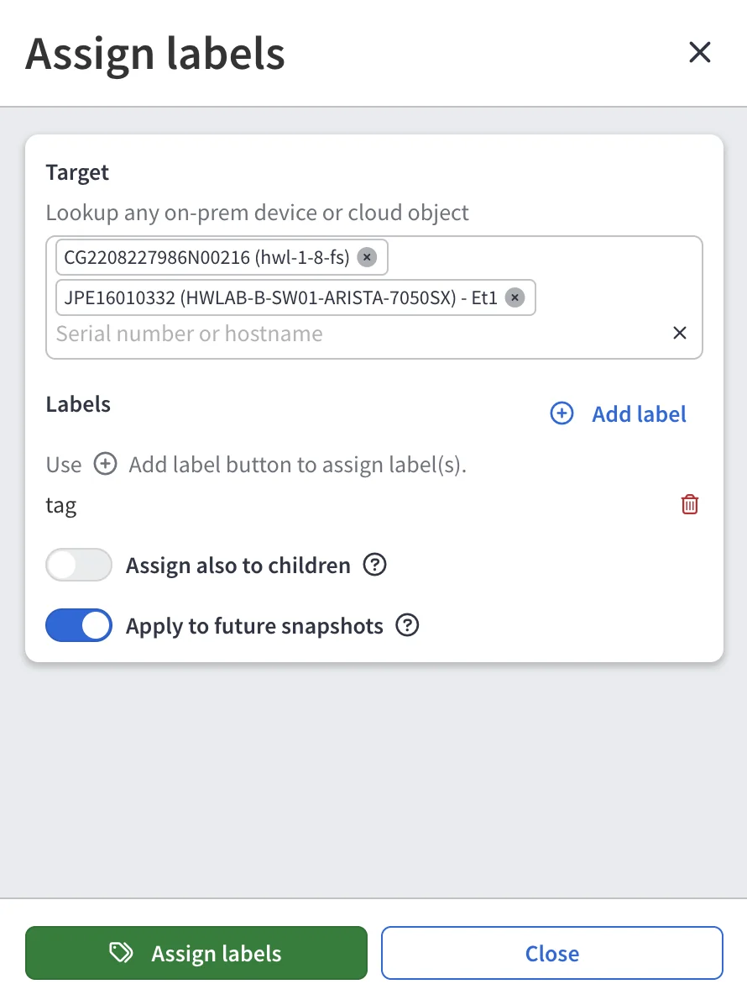
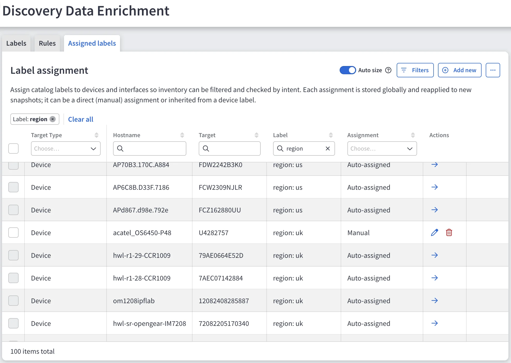
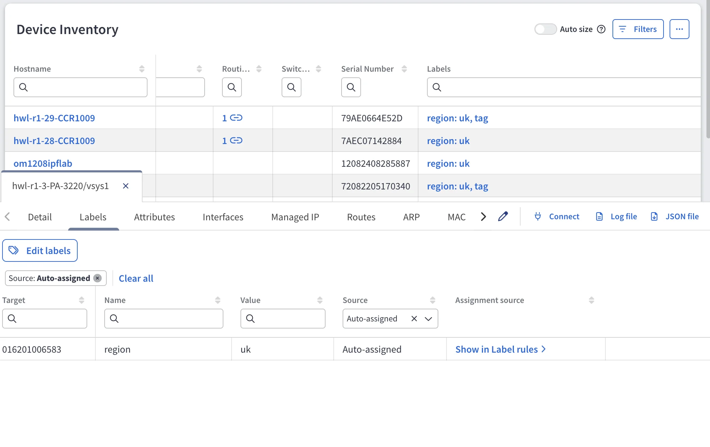

# Create and Assign Labels

--8<-- "snippets/labels_experimental.md"

## Create a Label in the Catalog

1. Navigate to **Settings --> Discovery & Snapshots --> Discovery Data Enrichment -->
   Labels** and click **+ Add new**.
2. Enter a label name -- for example, `region`.
3. (Optional) Add the values you expect to use with it -- for example, `uk`
   and `us`. A label without values, such as `tag`, works as a simple tag.

The catalog defines what the label picker offers. Creating a catalog entry does
not assign the label to anything.

## Assign a Label

1. Open the **Assigned labels** tab and click **+ Add new**.
2. In **Target**, search for the devices and interfaces to assign the label to.
   The search matches on hostname, serial number, and interface name, and
   searches across all loaded snapshots. Results show the target type, its
   most recent hostname, and the number of snapshots it appears in.
3. Select one or more targets. A single assignment can mix devices and
   interfaces.
4. Click **+ Add label** and pick the label and, if the label uses values, a
   value.
5. To push a device label down to that device's L2 interfaces, enable
   **Assign also to children**. The interfaces receive the label with the
   source **Inherited**. Removing the label from the device also removes it
   from its interfaces.
6. Keep **Apply to future snapshots** enabled to keep the assignment in
   future snapshots. When disabled, the assignment applies only to the
   current snapshot and disappears at the next label calculation. The switch
   is enabled by default when you work in the latest snapshot.
7. Click **Assign labels**.

The label appears on the selected targets in the current snapshot. With
**Apply to future snapshots** enabled, it also applies to every future
snapshot.

## Change or Remove an Assignment

In the **Assigned labels** tab, each row shows the target type, hostname,
target, label, and the source of the assignment in the **Assignment** column.

- Rows with the source **Manual**: use the icons in the **Actions** column to update or remove them.
- Rows with the source **Auto-assigned** or **Inherited** are read-only.
  The arrow in the **Actions** column leads to the
  [rule](automatic_assignment_rules.md) or the parent assignment that produced
  them -- update the rule, or remove the label from the parent device.

When you update or remove a manual assignment, enable **Apply to future
snapshots** to apply the change to future snapshots. Otherwise, the change
applies only to the current snapshot.

## Edit Labels in Device Explorer

You can also view and edit labels directly from technology tables, without
opening the settings page. In any table with a **Labels** column (for example,
**Inventory --> Devices**), click the labels of a row. Device Explorer opens
with a **Labels** tab listing every label on the object, with its **Name**,
**Value**, **Source**, and **Assignment source**.

- For **Auto-assigned** labels, **Show in Label rules** opens the rule that
  produced the label.
- To change the manual labels of the object, click **Edit labels**. Add labels
  with **+ Add label** or remove them with the trash icon, set **Apply to
  future snapshots**, and click **Save manual labels**.

You cannot update **Auto-assigned** or **Inherited** labels from Device
Explorer. Update the rule or the parent device's labels instead.

!!! warning "Older Snapshots"

    When you edit labels in a snapshot other than the latest one,
    **Apply to future snapshots** is disabled by default. If you enable it,
    the change applies to future snapshots, but it may not match what you see
    on screen -- the labels of these targets may have changed since the
    snapshot was taken. For changes that should persist, use the latest
    snapshot.
