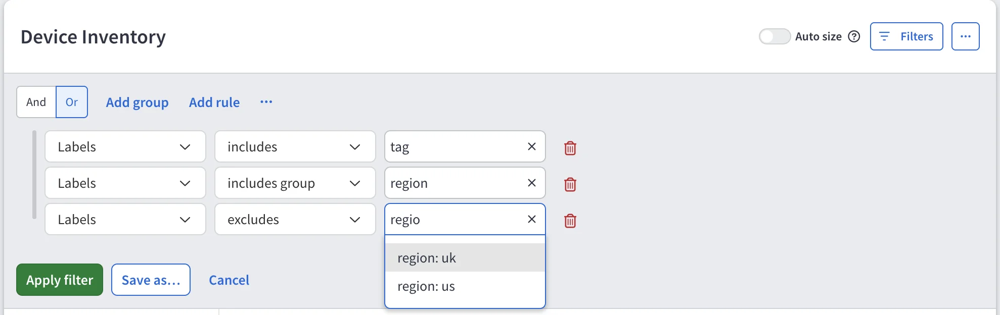

# Filter by Label

--8<-- "snippets/labels_experimental.md"

## The Labels Column

Device and interface technology tables include a **Labels** column showing
every label on the object. Where a table has both a device and an interface
side, the columns are **Device Labels** and **Interface Labels**.

The column lists labels regardless of assignment source. To see each label's source or edit manual labels, click a row's labels to open the **Labels** tab in Device Explorer. See
[Edit Labels in Device Explorer](create_and_assign_labels.md#edit-labels-in-device-explorer).

## Filtering

To filter by label, click **Filters** and add a rule for the **Labels**
column. The following operators are available:

- **includes** -- The object carries at least one of the selected labels, such
  as `region: uk`.
- **excludes** -- The object carries none of the selected labels.
- **includes group** -- The object carries a label with the selected name,
  with any value. For example, **includes group** `region` matches both
  `region: uk` and `region: us`.
- **excludes group** -- The object carries no label with the selected name.
- **is empty** / **is not empty** -- The object carries no labels, or at least
  one label.

To need several labels at once, add one rule per label and combine the
rules with **And**.

!!! info "Autocomplete Shows Assigned Labels Only"

    When you type a label in the filter value, autocomplete suggests only the
    labels that are assigned to at least one object in the current snapshot.
    Labels that exist only in the catalog, and are not assigned to anything in
    the current snapshot, are not suggested.

Label filters combine with other filters in the table. You can narrow a technology view to one region, one compliance zone, or one service. Export the result like any other table.

The **Labels** column is not sortable.

## Intent Checks

You can scope an intent check by label. The check then runs only against devices carrying that label, not the whole network. For example, scope a password policy check to devices labeled `pci`.

Changing label assignments recalculates intent checks that filter on labels. A new discovery is not needed.
