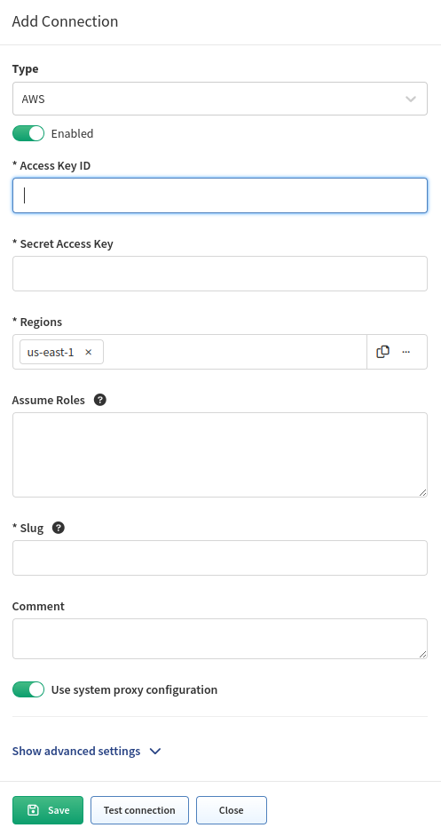

# AWS (Amazon Web Services)

## Configuring access to AWS API

To add AWS to the discovery you will need an access key & secret access key from your AWS account. These keys can be found/generated under your account in the AWS
dashboard.

Click **My Security Credentials** and open **Access keys** tab.

To generate keys, click **Create New Access Key** and your keys will be
generated. These access keys are available globally for all of yours AWS
regions.

Copy those keys to the AWS API settings in your IP Fabric and don't
forget to **fill the regions where the devices which you want to discover
are**. Multiple regions can be set for one API key and secret.

## Required IAM policy

To ensure that IP Fabric can retrieve all the required data to model the
AWS networks, a series of specific policies are required to be applied
to the user account or role used for the API key. [IAM-policy-IPF_6.4.json](aws/IAM-policy-IPF_6.4.json)
contains a JSON description of the required IAM policies.

## AWS AssumeRole

IP Fabric enables you to add AssumeRole targets to AWS API configuration. AssumeRole is typically used for delegating access to additional resources / account in AWS. IP Fabric will iterate through all listed ARNs, call `AssumeRole` against those, and do discovery on resources which became accessible.

!!! info "How `AssumeRole` works?"

    It returns a set of temporary access credentials that can be used to access AWS resources that original account might not normally have access to. For more information about AssumeRole see [AssumeRole - AWS Security Token Service](https://docs.aws.amazon.com/STS/latest/APIReference/API_AssumeRole.html).
