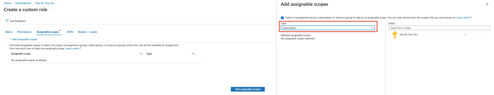
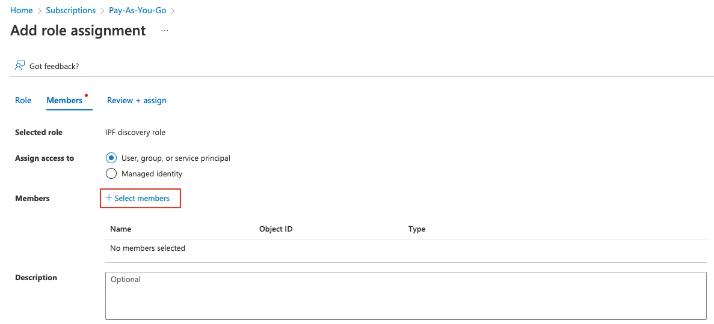

# Azure Networking

Starting from version `4.3`, IP Fabric supports discovery of the Azure Cloud
infrastructure. Azure devices are discovered only through API. IP
Fabric covers the IaaS (Infrastructure as a Service) part of the cloud.
Azure Cloud Compute provides an abstract view of the Azure physical
infrastructure.

- [Virtual Network](https://docs.microsoft.com/en-us/azure/virtual-network/virtual-networks-overview)
- [NAT Gateway](https://docs.microsoft.com/en-us/azure/virtual-network/nat-gateway/nat-gateway-resource)
- Virtual Network Gateway (both types: [VPN](https://docs.microsoft.com/en-us/azure/vpn-gateway/) and [ExpressRoute](https://docs.microsoft.com/en-us/azure/expressroute/expressroute-about-virtual-network-gateways)) and devices related to a [Virtual WAN](https://docs.microsoft.com/en-us/azure/virtual-wan/virtual-wan-about) solution:

  - Virtual HUB
  - VPN Gateway (the same functionality as VNGw type VPN)
  - ExpressRoute Gateway (the same functionality as VNGw type ExpressRoute)

Since version `7.2`, IP Fabric has introduced support for Load Balancers and Application Gateways.

## Azure Setup

To add Azure devices to the global discovery settings, go to **Settings -->
Discovery & Snapshots --> Discovery Settings --> Vendors API**, click **+ Add**,
and select `Azure` from the list.

IP Fabric requires the following to connect to the Azure API:

- **Tenant ID**
- **Client ID** (application ID)
- **Client Secret** (application secret)

Since version `6.7`, the **Subscription IDs** field is optional. Leave it empty to discover all available subscriptions within the same tenant.

Follow these steps to get the required data.

First, log in to the [Azure portal](https://portal.azure.com/).

### Register an App

Search for **Active Directory**.

1. From the left menu, click **App registrations**, then click **+New registration**.
2. Fill in the name of the application (e.g., `IP Fabric`). From the **Supported account types**, select the first option, **Single Tenant**. Leave the other options blank.
3. Once you click **Register**, you'll be redirected to the App overview page. Note the **Application (client) ID** and **Directory (tenant) ID**.
4. Click **Certificates & Secrets** and select the **Client secrets (0)** tab, click **+ New secret**, select Expiration, and then click **Add**.
5. Copy the created **client secret** to the clipboard (column Value). **You won't be able to see it again.**

### Subscription & Access Control

Search for **Subscriptions** and select the subscription you like to add to IP Fabric (IP Fabric can do discovery per subscription).

1. On the overview page, note the **Subscription ID**.
2. From the left menu, click Access control (IAM), click **+ Add**, and then **Add custom role**. Fill in the role name. IP Fabric requires specific permissions to make API calls. Select **Start from JSON** and upload the JSON file with the required permissions (find it at the very bottom of this page). Click the Next button to continue.

   

3. Review the permissions and click Next. Now you must assign a scope for this role. Click **Add assignable scopes** and from the right panel, select Type: Subscription, and then click the Subscription you want to assign.

   

4. Click **Review + Create**.
5. Now you must assign the newly created Role to the Registered App. From the left menu, select **Access control (IAM)** again, then click **+ New** and **Add role assignment**.
6. Find the previously created role, click **Next**, and then click **+ Select members**. Find the app you created before. Click **Review + Assign**.

   

### Role Definitions for IP Fabric

The following JSON format applies to IP Fabric version `7.3` and above:

```json title="azure-role-7_3.json"
--8<-- "docs/IP_Fabric_Settings/Discovery_and_Snapshots/Discovery_Settings/Vendors_API/azure/azure-role-7_3.json"
```

## What Counts Against IP Fabric License

See [Licensing -- Azure](../../../../overview/licensing.md#azure).
