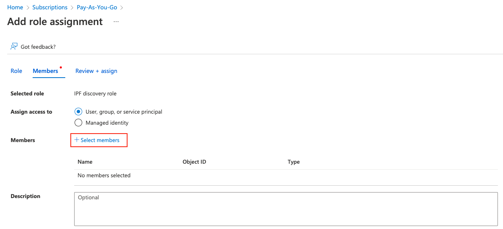

# Azure Networking

Starting version 4.3 IP Fabric supports the discovery of the Azure Cloud
infrastructure. Azure devices are discovered only through API. The IP
Fabric covers the IaaS (Infrastructure as a Service) part of the cloud.
Azure Cloud Compute provides an abstract view of the Azure physical
infrastructure.

- [Virtual Network](https://docs.microsoft.com/en-us/azure/virtual-network/virtual-networks-overview)
- [NAT Gateway](https://docs.microsoft.com/en-us/azure/virtual-network/nat-gateway/nat-gateway-resource)
- Virtual Network Gateway (both types: [VPN](https://docs.microsoft.com/en-us/azure/vpn-gateway/) and [ExpressRoute](https://docs.microsoft.com/en-us/azure/expressroute/expressroute-about-virtual-network-gateways)) and devices related to a [Virtual WAN](https://docs.microsoft.com/en-us/azure/virtual-wan/virtual-wan-about) solution:

  - Virtual HUB
  - VPN Gateway (the same functionality as VNGw type VPN)
  - ExpressRoute Gateway (the same functionality as VNGw type ExpressRoute)

We want to bring support for The plan is to add support of [Load Balancer](https://docs.microsoft.com/en-us/azure/load-balancer/load-balancer-overview) in one of next releases.

## Azure Setup

To add Azure devices to discovery global settings, go to **Settings -->
Discovery & Snapshots --> Discovery Settings --> Vendors API** and press the
**+Add** button.

IP Fabric needs the following data in order to connect to the Azure API
-- Tenant ID, Subscription ID, Application ID, and Application secret.
Follow these steps to get the required data.

First login to the Azure portal (<https://portal.azure.com/>)

### Register an App

Search for **Active Directory**.

1. From the left menu, click on **App registrations**, then click on **+New registration**.
2. Fill in the name of the application (e.g. `IP Fabric`). From the **Supported account types**, select the first option **Single Tenant**. Leave other options blank
3. Once you click on **Register**, you’ll be redirected to the App overview page. Note the **Application (client) ID** and **Directory (tenant) ID**
4. Click on **Certificates & Secrets** and select the **Client secrets (0)** tab, click **+ New secret**, select Expiration and then click **Add**.
5. Copy the created **client secret** to the clipboard (column Value). **You won’t be able to see it again**.

### Subscription & Access Control

Search for **Subscriptions** and select the subscription you like to add to IPF (IPF can do discovery per subscription)

1. On the overview page note the **Subscription ID**.
2. From the left menu, click on Access control (IAM), click on **+ Add** and **Add custom role**. Fill in the role name. IP Fabric requires specific permissions in order to make API calls. Select **Start from JSON** and upload JSON file with the required permissions (find it at the very bottom of this page). Click on the Next button to continue.

   

3. Review the permissions and click Next. Now you have to assign a scope for this role. Click on **Add assignable scopes** and from the right panel select Type: Subscription and than click on the Subscription you want to assign

   

4. Click on **Review + Create**
5. Now you have to assign the newly created Role to the Registered App. From the left menu, select again **Access control (IAM)** and then click **+ New** and **Add role assignment**.
6. Find the previously created role, click **Next** and then click on **+ Select members**. Find the app you created before. Click **Review + Assign**

   

### Role Definitions For IP Fabric

Following JSON format applies for IP Fabric version 4.3 and above:

```json title="azure-role-4_3.json"
--8<-- "docs/IP_Fabric_Settings/Discovery_and_Snapshots/Discovery_Settings/Vendors_API/azure/azure-role-4_3.json"
```
