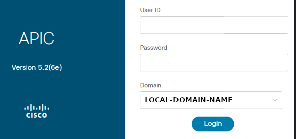
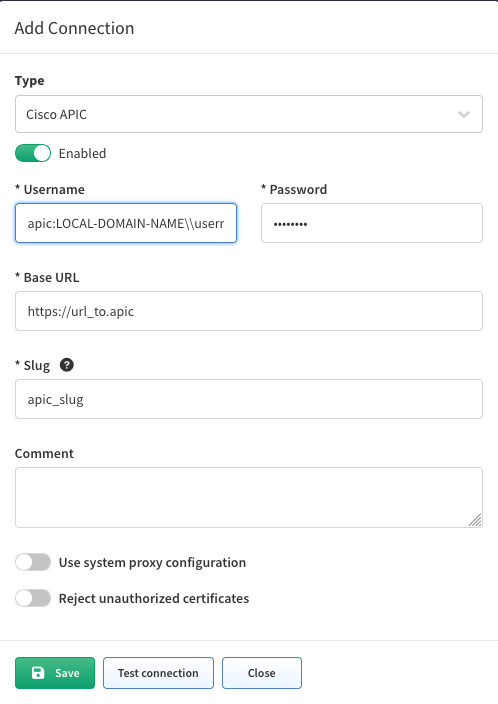

# Cisco APIC Discovery

## Overview

Starting from version `5.0`, IP Fabric collects information from APIC
controllers and provides information about Tenants (including Contexts/VRFs,
Applications, Endpoint groups, and Contracts) and APIC cluster members.

## Discovery Process

To successfully discover and collect data from Cisco ACI and APIC, follow
these steps:

1. Discover Spine and Leaf Switches
2. Add APIC Controllers to SSH Discovery
3. Configure APIC in Vendor API Settings

### 1. Discover Spine and Leaf Switches

First, you need to discover all spines and leaves (which are Nexus 9000 series
switches) using SSH. This step is crucial for collecting data about the ACI
fabric.

- Add the IP addresses of all spine and leaf switches to your discovery seeds.
- Ensure you have proper SSH credentials configured for these devices.

Benefits:

- Populates data in the Technology tables under **SDN --> ACI**, including:
  - ACI Endpoints
  - ACI VLANs
  - ACI VRFs
  - ACI DTEPs
- Enables end-to-end path simulation using the collected dataplane information.

### 2. Add APIC Controllers to SSH Discovery

To successfully discover the APIC, you need to add the APIC controllers to your
SSH discovery as well. This step creates network device entries in IP Fabric's
inventory, which are necessary to link the controller data.

- Add the IP addresses of all APIC controllers to your discovery seeds.
- Ensure you have proper SSH credentials configured for the APIC controllers.

### 3. Configure APIC in Vendor API Settings

After discovering the fabric and controllers via SSH, configure the APIC in the
Vendor API settings to extract additional data over API.

1. Go to **Settings --> Discovery & Snapshots --> Discovery Settings -->
Vendors API**.
2. Click **+ Add**.
3. Select `Cisco APIC` from the list.
4. Fill in the following information:
   - **Username** and **Password** used to log in to Cisco APIC.
   - **Base URL** of Cisco APIC (e.g., `https://cisco-apic-ip-address`).
   - [**Slug**](index.md#slug-and-comment) (optional).

    ??? info "Username if Local Domain Is Set on the APIC"

        If a local domain is set on your APIC controller, the format of the
        **Username** for IP Fabric settings is:
        ```text
        apic:LOCAL-DOMAIN-NAME\\username
        ```
        
        

5. Click **Save** to add the configuration.


Benefits:

- Adds additional information into the tables in the section **SDN --> APIC**.
- Provides more detailed insights into the ACI fabric configuration and
policies.

By following these steps, you'll ensure comprehensive discovery and data
collection from your Cisco ACI environment, including both the fabric devices
and the APIC controllers.

## Experimental Features

### ACI Service Graphs

Since 6.4.0, ACI service graphs can be enabled
[via feature flag](../../../../System_Administration/Command_Line_Interface/Feature_Flags.md#aci-service-graphs).
