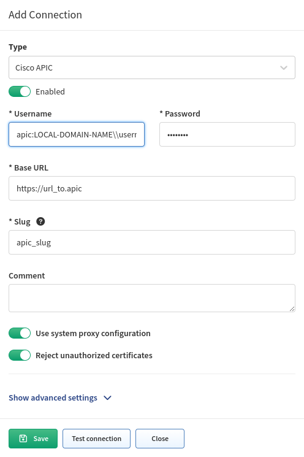

# Cisco APIC

Starting from version `5.0`, IP Fabric collects information from APIC controllers and provides information about Tenants (including Contexts/VRFs, Applications, Endpoint groups, and Contracts) and APIC cluster members.

Information about controllers is collected via SSH.

Data regarding Tenants, applications, contracts, etc., are collected via API.

To successfully collect data from Cisco APIC, it is necessary to configure Cisco APIC in the global Vendor API settings and add the Cisco APIC IP address to the discovery seeds.

Go to **Settings --> Discovery & Snapshots --> Discovery Settings --> Discovery
Seeds** and add the Cisco APIC IP address.

Then, go to **Settings --> Discovery & Snapshots --> Discovery Settings -->
Vendors API**, click **+ Add**, select `Cisco APIC` from the list, and fill in:

- **Username** and **Password** used to log in to Cisco APIC

  ??? info "Username if Local Domain Is Set on the APIC"

      If a local domain is set on your APIC controller, the format of the **Username** for IP Fabric settings is:

      ```text
      apic:LOCAL-DOMAIN-NAME\\username
      ```

      
      

- **Base URL** of Cisco APIC (e.g., `https://cisco-apic-ip-address`)

- [**Slug**](index.md#slug-and-comment)


