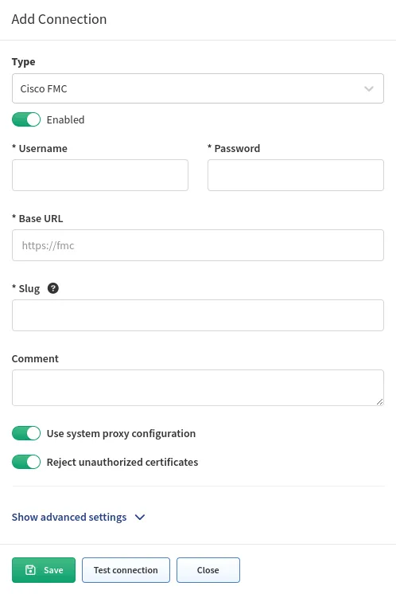
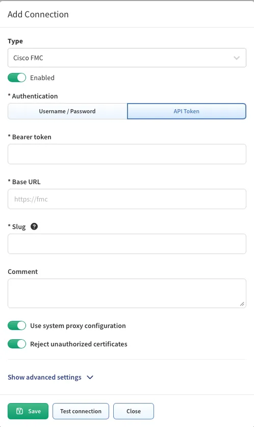

# Cisco FMC (FTD)

Starting from version `4.3`, IP Fabric collects zone firewall-related data for Cisco
Firepower devices **only via** the Cisco FMC API. Cisco Firepower devices are
still discovered via SSH. So, if Cisco Firepower devices are not managed via FMC,
they will still be discovered but **without** security-related information.

To discover Cisco Firepower security policies and utilize the Zone Firewall feature
in IP Fabric, it is necessary to control Cisco Firepower through Cisco FMC
(Firewall Management Center) and add Cisco FMC to the global Vendor API
settings.

Go to **Settings --> Discovery & Snapshots --> Discovery Settings --> Vendors
API**, click **+ Add**, select `Cisco FMC` from the list, and fill in:

- **Username** and **Password** used to log in to Cisco FMC
- **Base URL** of Cisco FMC server (e.g., `https://cisco-fmc-ip-address`)
- [**Slug**](index.md#slug-and-comment)



### Discovery of FMC Hosted by Cisco Defense Orchestrator

When FMC is hosted by Cisco Defense Orchestrator, discovery and data collection has to be handled differently. The main difference is in using an API key instead of a username/password.

Since `6.7`, it is possible to enable API key authentication for FMC by adding the following line to the `global` environment file `/etc/default/ipf-appliance-local`:

```
ENABLE_FMC_TOKEN_AUTH=true
```

After updating the environment file, you must restart IP Fabric application by running the following command:

```
sudo systemctl restart ipf-appliance
```



## Known Issue

- [FMC REST API Calls Returns HTTP Error Code 500](../../../../support/known_issues/Vendors/cisco/FMC_REST_API.md)
