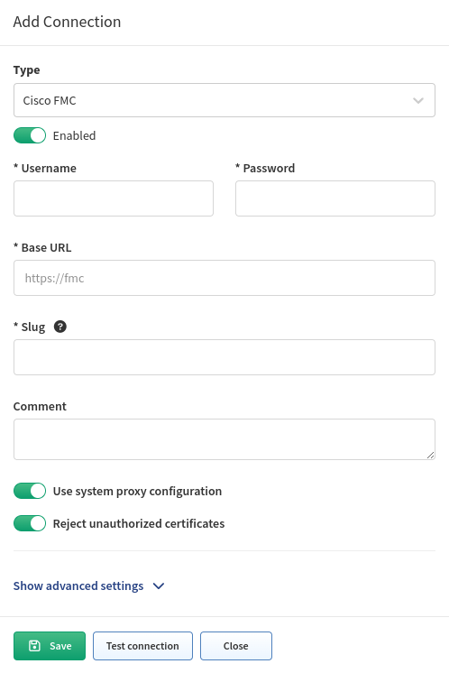

# Cisco FMC (FTD)

Starting version `4.3`, IP Fabric collects zone-firewall related data for Cisco
Firepower devices **only via** Cisco FMC API. Cisco Firepower devices are
still discovered via SSH. So if Cisco Firepower devices are not managed via FMC,
they will still be discovered but **without** security related information.

To discover Cisco Firepower security policies and use the Zone Firewall feature
in IP Fabric, it is necessary to control Cisco Firepower through Cisco FMC
(Firewall Management Center) and add Cisco FMC to the global Vendor API
settings.

Go to **Settings --> Discovery & Snapshots --> Discovery Settings --> Vendors
API** and click **+ Add**.

Afterwards, select `Cisco FMC` from the list and fill in:

- **Username and password** used to log in to Cisco FMC
- **Base URL** of Cisco FMC server, e.g. `https://cisco-fmc-ip-address`
- [**Slug**](index.md#slug-and-comment)

## Known Issue

[FMC REST API Calls Returns HTTP Error Code 500](../../../../support/known_issues/Vendors/cisco/FMC_REST_API.md)
