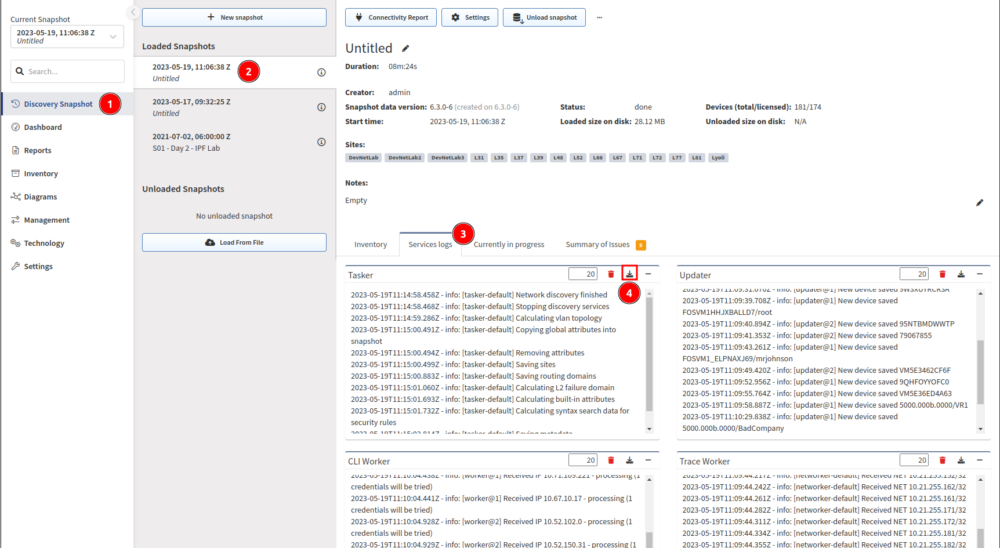

# Cisco Meraki

Starting IP Fabric version **3.5.0**, IP Fabric supports API-based discovery for Cisco Meraki.

## Meraki Requires The Following Settings To Be Applied:

- **API key** -- Generated in Meraki dashboard
- **Organizations ID** -- You can specify which organization will be included in the discovery process. If you do not specify, all available IDs will be used
- **Version** -- Only `v1` is supported since IPF v5.0. Similarly to the original `v0`, even the latest API version has a lot of limitations (Meraki known issues)
- **Base URL** -- URL is supported in the following format `https://nXYZ.meraki.com/api`. Be aware that the dashboard can redirect communication to a different URL

## Login IP For Cisco Meraki

For the CLI (SSH/Telnet) discovery, the Login IP represents the IP address that platform uses to discover the device. IP Fabric discovers Cisco Meraki via API, and therefore different logic described below is used to assign Login IP parameter for Meraki devices in the main inventory.

```bash
LAN IP is considered to have the highest priority
------- key --> 'lanIp'
wan1Ip has the 2nd highest priority
------- key --> 'wan1Ip'
wan2Ip has the 3rd highest priority
------- key --> 'wan2Ip'
publicIp has the lowest priority
------- key --> 'publicIp'
```

!!! info

    The `publicIp` parameter can have duplicate values across inventory as more devices can be accessed via the same public IP address. It can also be inaccurate (e.g., when the WAN circuit fails to the secondary circuit) because it can take quite a long time to refresh the device's public IP in the dashboard.

To understand what is being sent from Meraki’s Dashboard, we need to look into the Discovery Snapshot and download the Tasker or Log File from the device:



The Tasker file contains complete communication between IP Fabric and Meraki Dashboard. We can use the device hostname to locate the JSON source:

```js
{
   "name":"mx01-dl1",
   "serial":"Q2QN-Q6EY-NP7J",
   "mac":"0c:8d:db:b0:c2:dc",
   "networkId":"L_783626335162466320",
   "model":"MX65",
   "address":"",
   "lat":37.4180951010362,
   "lng":-122.098531723022,
   "notes":"",
   "tags":"",
   "wan1Ip":"192.168.128.4",
   "wan2Ip":null,
   "configurationUpdatedAt":"2022-03-05T15:07:48Z",
   "firmware":"wired-15-44",
   "url":"https://XXX.meraki.com/DevNetLab-applia/n/xaNlkcig/manage/nodes/new_list/456789654858"
}
```

## Known Issues

[Meraki API Limited Functionality](../../../../support/known_issues/Vendors/meraki.md)
