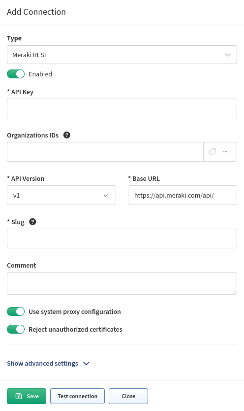
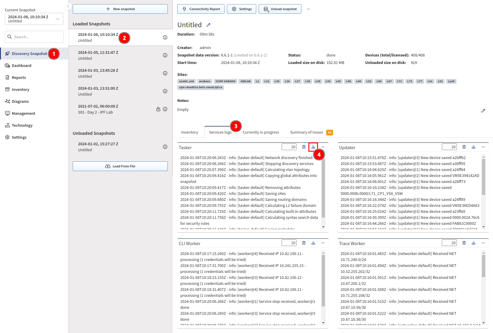

# Cisco Meraki

Since version `3.5.0`, IP Fabric supports API-based discovery for Cisco Meraki.

To add Cisco Meraki to the global discovery settings, go to **Settings -->
Discovery & Snapshots --> Discovery Settings --> Vendors API**, click **+ Add**,
select `Meraki REST` from the list, and fill in:

- **API key** -- Generated in the Meraki Dashboard.
- **Organizations ID** -- You can specify which organization will be included in the discovery process. If you do not specify that, all available IDs will be used.
- **Version** -- Only `v1` is supported since IP Fabric `5.0`. Similarly to the original `v0`, even the latest API version has a lot of limitations (Meraki known issues).
- **Base URL** -- URL of the Meraki Dashboard API (e.g., `https://api.meraki.com/api` or `https://nXYZ.meraki.com/api`). For organizations hosted in the China Dashboard, please use `.cn` instead of `.com`.
- [**Slug**](index.md#slug-and-comment)



## Login IP for Cisco Meraki

For CLI (SSH/Telnet) discovery, the Login IP represents the IP address that the platform uses to discover the device. IP Fabric discovers Cisco Meraki via API, and therefore, different logic described below is used to assign the Login IP parameter for Meraki devices in the main inventory.

```bash
LAN IP is considered to have the highest priority.
------- key --> 'lanIp'
wan1Ip has the 2nd highest priority.
------- key --> 'wan1Ip'
wan2Ip has the 3rd highest priority.
------- key --> 'wan2Ip'
publicIp has the lowest priority.
------- key --> 'publicIp'
```

!!! info

    The `publicIp` parameter can have duplicate values across the inventory as more devices can be accessed via the same public IP address. It can also be inaccurate (e.g., when the WAN circuit fails to the secondary circuit) because it can take quite a long time to refresh the device's public IP address in the Dashboard.

To understand what is being sent from the Meraki Dashboard, we need to investigate the Discovery Snapshot and download the Tasker file or log file from the device:



The Tasker file contains complete communication between IP Fabric and the Meraki Dashboard. We can use the device hostname to locate the JSON source:

```json
{
   "name":"mx01-dl1",
   "serial":"Q2QN-Q6EY-NP7J",
   "mac":"0c:8d:db:b0:c2:dc",
   "networkId":"L_783626335162466320",
   "model":"MX65",
   "address":"",
   "lat":37.4180951010362,
   "lng":-122.098531723022,
   "notes":"",
   "tags":"",
   "wan1Ip":"192.168.128.4",
   "wan2Ip":null,
   "configurationUpdatedAt":"2022-03-05T15:07:48Z",
   "firmware":"wired-15-44",
   "url":"https://XXX.meraki.com/DevNetLab-applia/n/xaNlkcig/manage/nodes/new_list/456789654858"
}
```

## Known Issue

- [Meraki API Limited Functionality](../../../../support/known_issues/Vendors/meraki.md)
