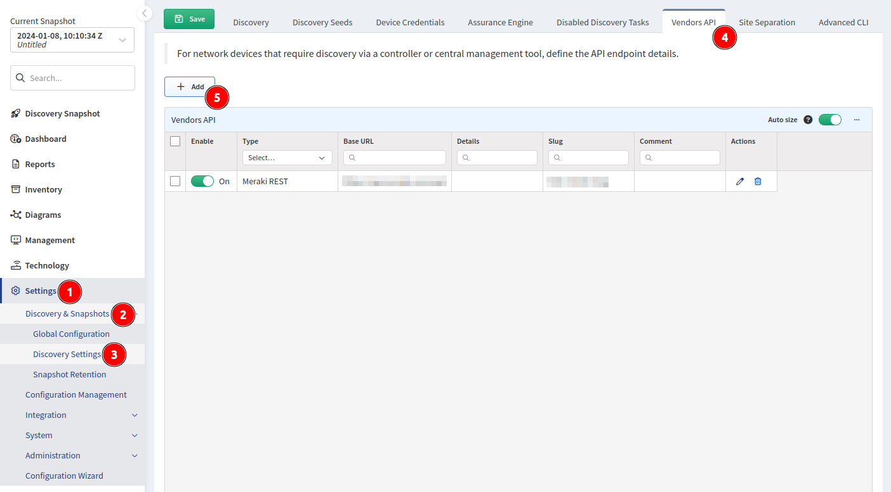
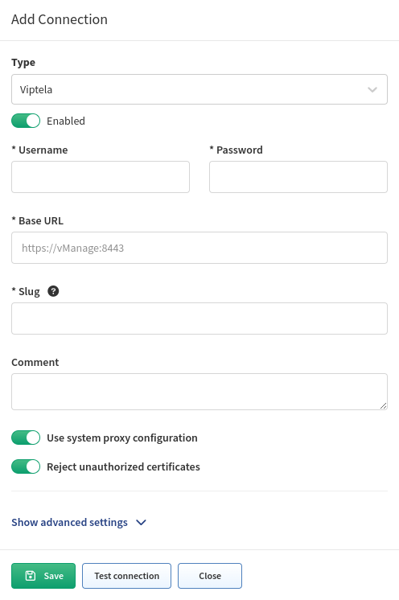

# Cisco Viptela

## Cisco Viptela SD-WAN

Starting version `4.1.0`, IP Fabric supports Viptela API. Viptela devices are discovered only through API. Both CLI and vManage modes are supported. Some tasks, which get information from templates are supported only for devices in vManage mode (see our [feature matrix](https://matrix.ipfabric.io) for more details).

1. To add Viptela to discovery global settings, go to **Settings --> Discovery & Snapshots --> Discovery Settings --> Vendors API** and press the **+ Add** button:

   

2. Afterwards, choose **Viptela** from the list and fill in:

   - **Username and password** used to log in to vManage
   - **Base URL** of vManage server ([https://vmanage-ip-address](https://vmanage-ip-address))
   - [**Slug**](index.md#slug-and-comment)

   

## Cisco Viptela cEdge

Starting version `4.4.0`, IP Fabric supports Viptela on Cisco IOS XE devices in the controller (SD-WAN) mode (cEdge). Thus from the version 4.4 cEdge devices are discoverable only through the vManage API.

## Known Issues

[Viptela CEdge shows only one next-hop](../../../../support/known_issues/Vendors/cisco/Viptela_CEdge_shows_only_one_next_hop.md)

[Viptela Serial Number (SN) Pairing in Cisco Coverage Checker](../../../../support/known_issues/Vendors/cisco/Viptela_vSmart_SN.md)
