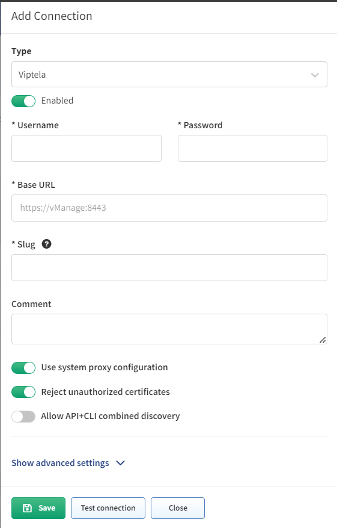

# Cisco Viptela

## Cisco Viptela SD-WAN

Starting with version `4.1.0`, IP Fabric supports Viptela API. Viptela devices are discovered through API (or the combination of API and CLI). Both CLI and vManage modes are supported. Some tasks, which get information from templates, are supported only for devices in vManage mode (see our [feature matrix](https://matrix.ipfabric.io) for more details).

Since `6.8.0`, IP Fabric supports discovering Cisco Viptela devices in combined (hybrid) mode.

1. To add Viptela to discovery global settings, go to **Settings --> Discovery & Snapshots --> Discovery Settings --> Vendors API** and click **+ Add**:

   

2. Afterwards, choose `Viptela` from the list and fill in:

   - **Username and password** used to log in to vManage
   - **Base URL** of vManage server (`https://vmanage-ip-address`)
   - [**Slug**](index.md#slug-and-comment)

3. Optionally, you may enable **Allow API+CLI combined discovery**, which allows the retrieval of data partially using API calls and partially using CLI commands.

   

## Cisco Viptela cEdge

Starting with version `4.4.0`, IP Fabric supports Viptela on Cisco IOS XE devices in the controller (SD-WAN) mode (cEdge). Thus, from version `4.4.0`, cEdge devices are discoverable only through the vManage API.

## Known Issues

- [Viptela cEdge shows only one next-hop](../../../../support/known_issues/Vendors/cisco/Viptela_cEdge_shows_only_one_next_hop.md)
- [Viptela Serial Number (SN) Pairing in Cisco Coverage Checker](../../../../support/known_issues/Vendors/cisco/Viptela_vSmart_SN.md)
