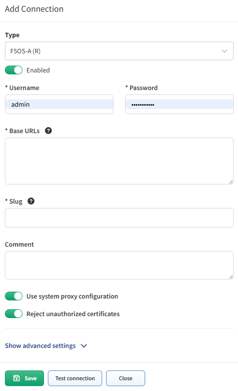

# F5OS

## Supported F5OS Variants

- **F5OS-A** (R-series)
- **F5OS-C** (VELOS)

## How to Add F5OS to API discovery

- Navigate to **Settings --> Discovery & Snapshots --> Discovery Settings --> Vendors API**.
- Click **+ Add**
- From the list, choose: 
  - `F5OS-A (R)` or
  - `F5OS-C (VELOS)`
- Fill in:
  - **Username** and **Password** used to log in to all F5OS base URLs
  - **Base URLs** line separated list of base URLs sharing the same username and password (e.g., `https://f5os-ip-address`)
  - [**Slug**](index.md#slug-and-comment)
  - [**Comment**](index.md#slug-and-comment)

