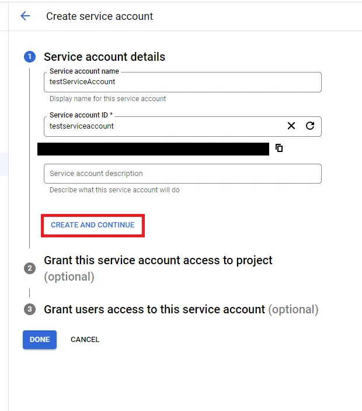

# Google Cloud Platform (GCP)

## How To Enable GCP APIs

Since version 7.8 and above requires these GCP APIs to be enabled for full functionality:

- Cloud Resource Manager API (cloudresourcemanager.googleapis.com)
- Compute Engine API (compute.googleapis.com)
- Network Connectivity API (networkconnectivity.googleapis.com)

1. Select the project where you want to enable the API:

   

2. Navigate to **APIs & Services --> API Library --> Browse**, search for the API, and select it:

   

3. Enable the API:

   

4. Repeat these steps for all required APIs and projects.

## How To Create a Custom Role

1. Select your organization. If you don’t have an organization, or if you prefer not to grant IP Fabric access to the entire organization, you can create the custom roles at the project level:

   

2. Navigate to **IAM & Admin --> Roles**:

   

3. Create a custom role and assign the following permissions required for IP Fabric version 7.8 and above:

   ```
   resourcemanager.projects.list (organization-level permission)
   resourcemanager.projects.get
   networkconnectivity.regionalEndpoints.get
   compute.addresses.list
   compute.autoscalers.list
   compute.backendServices.get
   compute.backendServices.list
   compute.firewalls.list
   compute.forwardingRules.list
   compute.instanceGroupManagers.list
   compute.instanceGroups.list
   compute.instanceTemplates.list
   compute.instances.list
   compute.interconnectAttachments.list
   compute.networkEndpointGroups.list
   compute.networks.list
   compute.routers.get
   compute.routers.list
   compute.routes.list
   compute.serviceAttachments.list
   compute.subnetworks.list
   compute.targetGrpcProxies.list
   compute.targetHttpProxies.list
   compute.targetHttpsProxies.list
   compute.targetTcpProxies.list
   compute.targetVpnGateways.list
   compute.urlMaps.list
   compute.vpnGateways.list
   compute.vpnTunnels.list
   compute.zones.list
   ```

   

## How To Generate a Private Key for Your GCP Service Account

1. Select a project for which you want to create a service account:

   

2. Navigate to **IAM & Admin --> Service Accounts**:

   

3. Click **+ CREATE SERVICE ACCOUNT**:

   

4. Give it a name and click **CREATE AND CONTINUE**:

   

5. Select the custom role you created in the previous step for the account, then click **CONTINUE**:

   

6. In the last step, simply click **DONE**:

   

7. Search for the account that was just created and select it:

   

8. Navigate to the **KEYS** tab, click **ADD KEY**, and select `Create new key`.
   (You can use your own key, but the properties must be the same as when you
   generate it. Therefore, it is highly recommended to use the `Create new key` option.)

   

9. The key type we support is `JSON`. Click **CREATE**, and the private key will
   be downloaded to your computer.

   

## Grant the Service Account Access to Your Organization

1. Select your organization. (Alternatively, you can perform this step within individual projects.):

   

2. Navigate to **IAM & Admin --> IAM**, and click **Grant access**:

   

3. Enter the Service Account email address and assign the custom role:

   

## How To Load the `JSON` Key to IP Fabric

1. In the IP Fabric GUI, navigate to **Settings --> Discovery & Snapshots -->
   Discovery Settings --> Vendors API**, and click **+ Add**:

   

2. Select `Google Cloud Platform` from the list.

3. Move your key to the Drag&Drop area or select it from your computer, and
   enter the other required information:

   

## What Counts Against IP Fabric License

See [Licensing -- GCP](../../../../overview/licensing.md#gcp).
