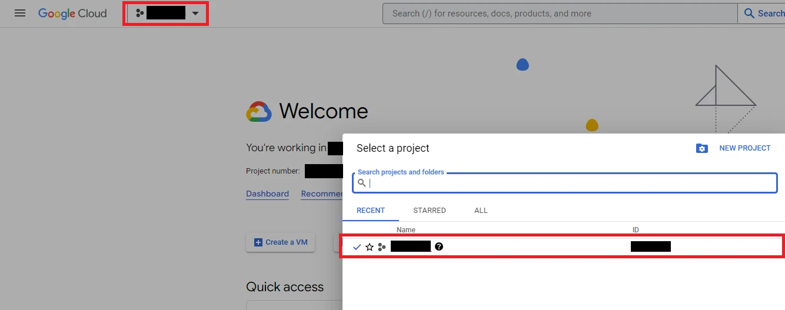
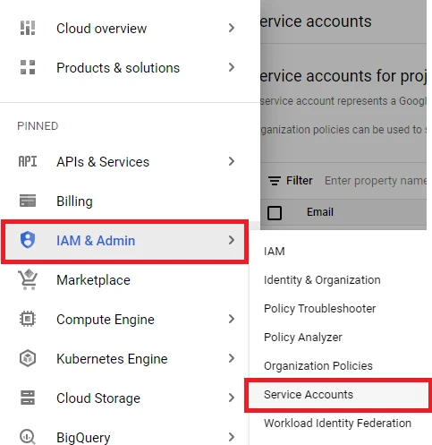
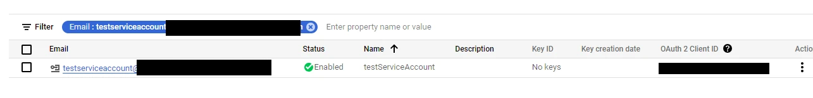
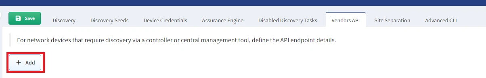

# Google Cloud Platform (GCP)

## Generate a Private Key for Your GCP Service Account

1. Select a project for which you want to create a service account:

   

2. Navigate to **IAM & Admin --> Service Accounts**:

   

3. Click **+ CREATE SERVICE ACCOUNT**:

   

4. Give it a name and click **CREATE AND CONTINUE**:

   

5. Select a role for the account. We recommend using the `Viewer` role as it
   provides only read access to the project. Then, click **CONTINUE**.

   

6. In the last step, simply click **DONE**:

   

7. Search for the account that was just created and select it:

   

8. Navigate to the **KEYS** tab, click **ADD KEY**, and select `Create new key`.
   (You can use your own key, but the properties must be the same as when you
   generate it. Therefore, it is highly recommended to use the `Create new key` option.)

   

9. The key type we support is `JSON`. Click **CREATE**, and the private key will
   be downloaded to your computer.

   

## Load the `JSON` Key to IP Fabric

1. In the IP Fabric GUI, navigate to **Settings --> Discovery & Snapshots -->
   Discovery Settings --> Vendors API**, and click **+ Add**:

   

2. Select `Google Cloud Platform` from the list.

3. Move your key to the Drag&Drop area or select it from your computer, and
   enter the other required information:

   

## What Counts Against IP Fabric License

See [Licensing -- GCP](../../../../overview/licensing.md#gcp).
