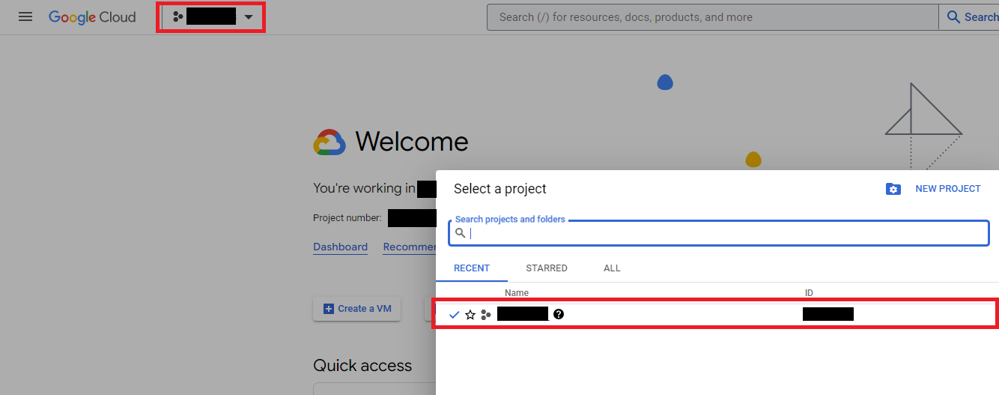
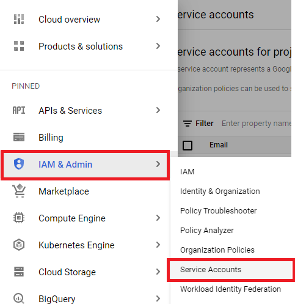
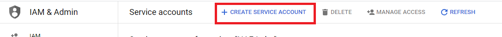
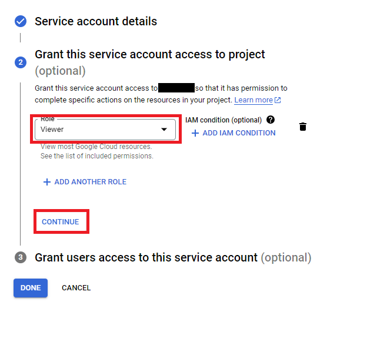
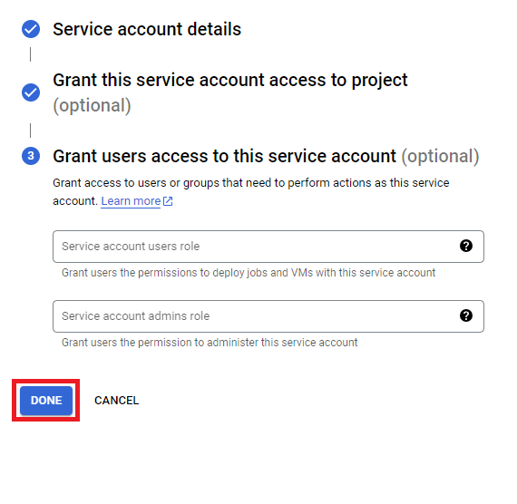
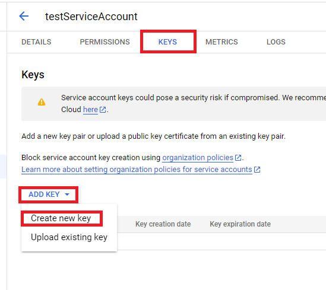
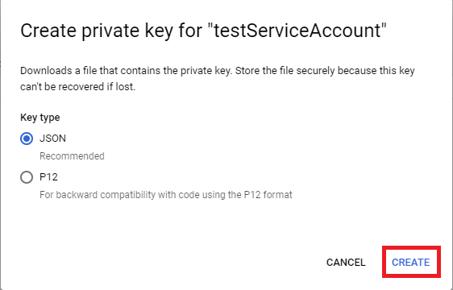
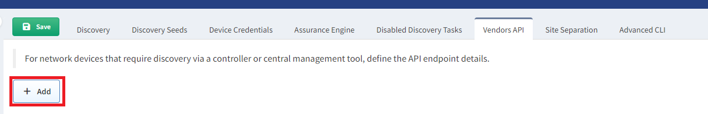
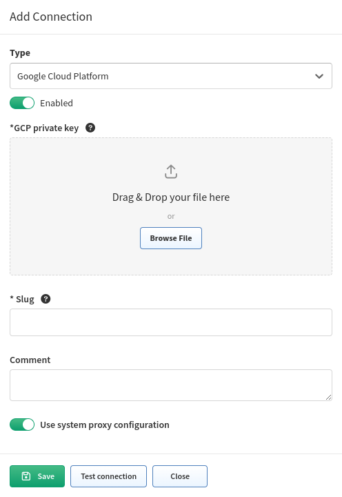

# Google Cloud Platform (GCP)

## Generate a private key for your GCP service account

1. Select a project that you want to create a service account for:

   

2. Navigate to **IAM & Admin --> Service Accounts**:

   

3. Click **+ CREATE SERVICE ACCOUNT**:

   

4. Give it a name and click **CREATE AND CONTINUE**:

   

5. Select a role for the account. We recommend to use the `Viewer` role as it
   gives only read access to the project. Afterwards, click **CONTINUE**.

   

6. In the last step, just click **DONE**:

   

7. Search for the account that was just created and select it:

   

8. Navigate to the **KEYS** tab, click **ADD KEY** and select `Create new key`.
   (You can use your own key, but the properties have to be the same as when you
   generate it. So it is highly recommended to use the `Create new key` option.)

   

9. The key type we support is `JSON`. Click **CREATE** and the private key will
   be downloaded to your computer.

   

## Load the `JSON` key to IP Fabric

1. In the IP Fabric GUI, navigate to **Settings --> Discovery & Snapshots -->
   Discovery Settings --> Vendors API** and click **+ Add**:

   

2. Select `Google Cloud Platform` from the list.

3. Move your key to the Drag&Drop area or select it from your computer. And
   enter the other required information.

   
