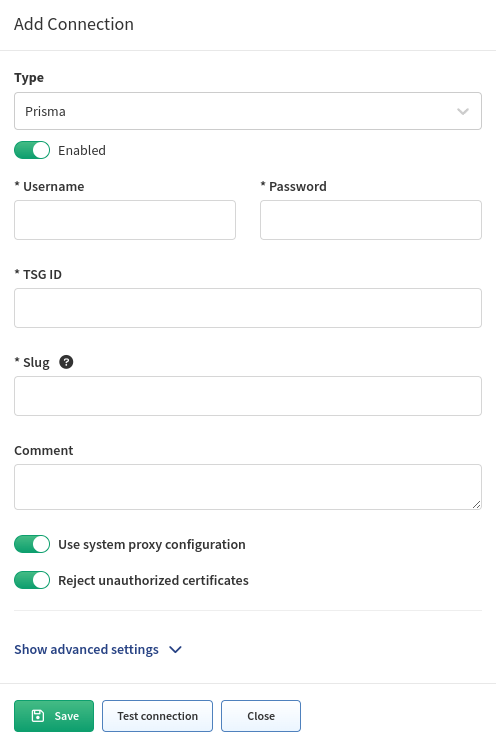

# Palo Alto Prisma SASE

Starting version **6.1.0** IP Fabric supports Palo Alto Prisma SASE unified API.

A [service account](https://pan.dev/sase/docs/service-accounts/) has to be created with RO role `View Only Administrator` or higher.

In IP Fabric, go to **Settings --> Discovery & Snapshots --> Discovery Settings --> Vendors API**, press the **+Add** button, select **Prisma** from the list and fill in the following login details:

- **Username** -- Service account username
- **Password** -- Service account password
- **TSG ID** -- [Tenant service group ID](https://docs.paloaltonetworks.com/common-services/subscription-and-tenant-management/manage-multitenants/what-is-a-tenant)

## Known Issues

Path lookup isn't fully supported. Currently Prisma SASE unified API doesn't have all needed endpoints.
