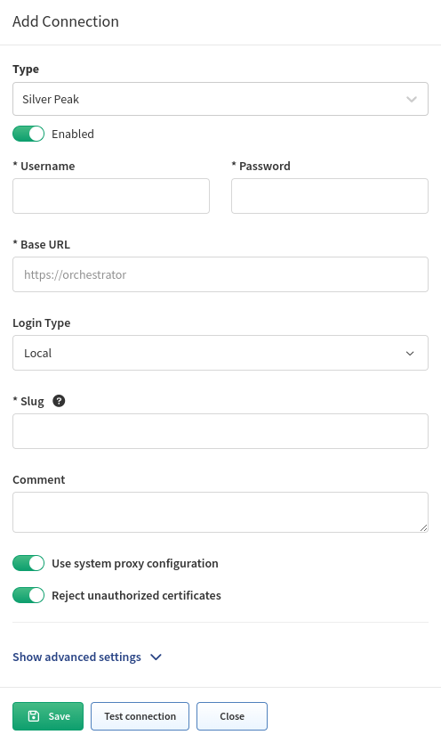

# Silver Peak SD-WAN

Starting with version `4.3`, IP Fabric supports discovery of Silver Peak (Aruba) EdgeConnect devices in router mode.

EdgeConnect devices are discovered only through the API.

To add EdgeConnect to the global discovery settings, go to **Settings -->
Discovery & Snapshots --> Discovery Settings --> Vendors API**, click **+ Add**,
select `Silver Peak` from the list, and fill in:

- **API key**, or
- **Username** and **Password** with **Login Type** (select `Local`, `RADIUS`, or `TACACS+`) to log in to Unity Orchestrator

  !!! info

      If the user has just read-only rights, the ARP table will **not** be
      downloaded. This is a known limitation of the orchestrator's API.

- **Base URL** of Unity Orchestrator (`https://unity-orchestrator-host`)

- [**Slug**](index.md#slug-and-comment)

