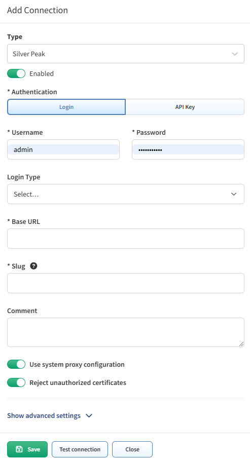

# Silver Peak SD-WAN

Starting version `4.3`, IP Fabric supports the discovery of Silver Peak (Aruba) EdgeConnect devices in router mode.

EdgeConnect devices are discovered only through API.

To add EdgeConnect to discovery global settings, go to **Settings --> Discovery & Snapshots --> Discovery Settings --> Vendors API** and click **+ Add**.

Afterwards, choose `Silver Peak` from the list and fill in:

- **Username and password** to log in to Unity Orchestrator

  !!! info

      If the user has just read-only rights, ARP table will **not** be downloaded. This is the know limitation of the orchestrator’s API.

- **Base URL** of Unity Orchestrator (`https://unity-orchestrator-host`)

- **Login Type** - select `Local`, `RADIUS`, or `TACACS+`

- [**Slug**](index.md#slug-and-comment)

