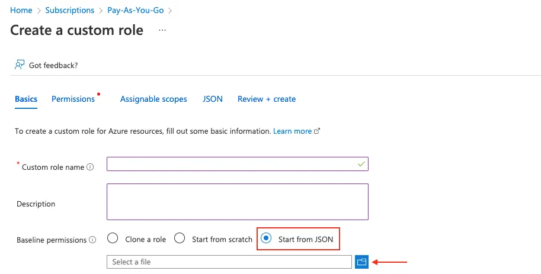
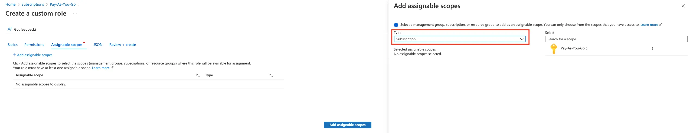
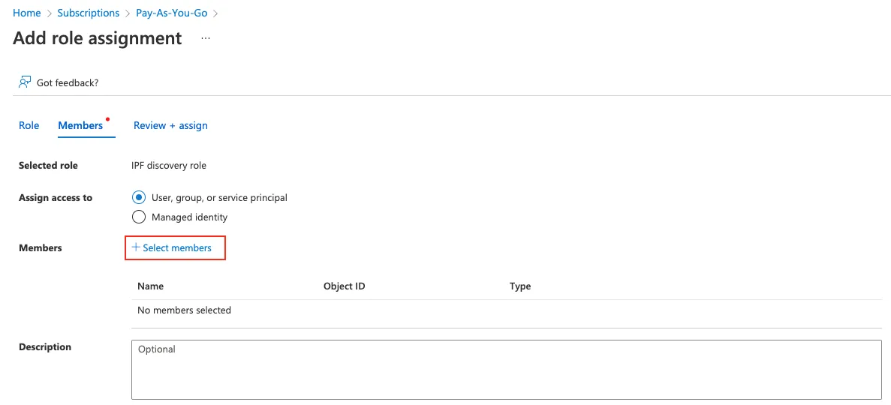

# Azure

To add Azure devices to the global discovery settings, go to **Settings -->
Discovery & Snapshots --> Discovery Settings --> Vendors API**, click **+ Add**,
and select `Azure` from the list.

IP Fabric requires the following to connect to the Azure API:

- **Tenant ID**
- **Client ID** (application ID)
- **Client Secret** (application secret)

Since version `6.7`, the **Subscription IDs** field is optional. Leave it empty to discover all available subscriptions within the same tenant.

Follow these steps to get the required data.

First, log in to the [Azure portal](https://portal.azure.com/).

### Register an App

Search for **Active Directory**.

1. From the left menu, click **App registrations**, then click **+New registration**.
2. Fill in the name of the application (e.g., `IP Fabric`). From the **Supported account types**, select the first option, **Single Tenant**. Leave the other options blank.
3. Once you click **Register**, you'll be redirected to the App overview page. Note the **Application (client) ID** and **Directory (tenant) ID**.
4. Click **Certificates & Secrets** and select the **Client secrets (0)** tab, click **+ New secret**, select Expiration, and then click **Add**.
5. Copy the created **client secret** to the clipboard (column Value). **You won't be able to see it again.**

### Subscription & Access Control

Search for **Subscriptions** and select the subscription you like to add to IP Fabric (IP Fabric can do discovery per subscription).

1. On the overview page, note the **Subscription ID**.
2. From the left menu, click Access control (IAM), click **+ Add**, and then **Add custom role**. Fill in the role name. IP Fabric requires specific permissions to make API calls. Select **Start from JSON** and upload the JSON file with the [required permissions](azure/azure-role-7_12.json) (find details at the very [bottom of this page](#role-definitions-for-ip-fabric)). Click the Next button to continue.

   

3. Review the permissions and click Next. Now you must assign a scope for this role. Click **Add assignable scopes** and from the right panel, select Type: Subscription, and then click the Subscription you want to assign.

   

4. Click **Review + Create**.
5. Now you must assign the newly created Role to the Registered App. From the left menu, select **Access control (IAM)** again, then click **+ New** and **Add role assignment**.
6. Find the previously created role, click **Next**, and then click **+ Select members**. Find the app you created before. Click **Review + Assign**.

   

### Management Group Access

Since version `7.12`, IP Fabric requires read access to management groups to build a resource hierarchy. This requires a second custom role with two permissions:

- `Microsoft.Management/managementGroups/read`
- `Microsoft.Management/managementGroups/descendants/read`

Azure only grants these permissions when the role is assigned at the management group scope, not at the subscription scope. So a separate custom role is needed for this.

!!! note "Why not the built-in Management Group Reader role?"
    The built-in Azure **Management Group Reader** role does not include `Microsoft.Management/managementGroups/descendants/read`.

#### Create the Management Group Reader Role

1. In the Azure portal, search for **Management groups** and open the management group you want to use as the scope.
2. From the left menu, click **Access control (IAM)**, then **+ Add** → **Add custom role**.
3. Select **Start from JSON**, upload [`azure-mgmt-group-reader.json`](azure/azure-mgmt-group-reader.json) (find details at the bottom of this page), and click **Review + Create**.
4. Back in **Access control (IAM)**, click **+ Add** → **Add role assignment**, find the new role, and assign it to the registered app.

### Role Definitions for IP Fabric

The following JSON applies to IP Fabric version `7.12` and above:

```json title="azure-role-7_12.json"
--8<-- "docs/IP_Fabric_Settings/Discovery_and_Snapshots/Discovery_Settings/Vendors_API/azure/azure-role-7_12.json"
```

To enable management group access, create and assign the following role at the management group scope:

```json title="azure-mgmt-group-reader.json"
--8<-- "docs/IP_Fabric_Settings/Discovery_and_Snapshots/Discovery_Settings/Vendors_API/azure/azure-mgmt-group-reader.json"
```

## What Counts Against IP Fabric License

See [Licensing -- Azure](../../../../overview/licensing.md#azure).
