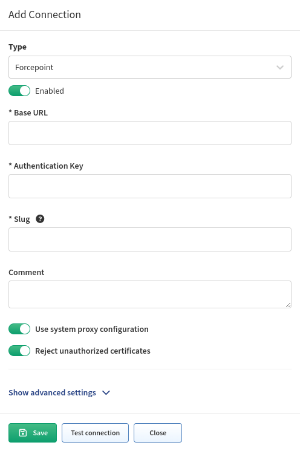

# Forcepoint

Starting with version `6.1.0`, IP Fabric supports the Forcepoint SMC API. Forcepoint devices are discovered though CLI, and only configuration references, such as security rules, are downloaded via the SMC API.

## How To Add Forcepoint SMC to IP Fabric

### Generate API Token

1. Log in to the Forcepoint SMC web UI.

   

2. Generate API tokens:

   - Click **Configuration**.
   - Navigate to **Configuration --> Administration --> Access Rights --> API Clients**.
   - Then, click **New**.

   

3. Add a name for the newly created entry and **copy the token**. Once the settings are saved, the **token will be hidden**. Also, add read-access privileges.

   

4. The API endpoint needs to be enabled explicitly, as it is disabled by default:

   - Click **Home**.
   - Go to **Others** section on the left sidebar.
   - Find your management server that you will use to query the data.
   - Go to the **SMC API** tab, where you must enable it, and you can also specify other parameters.

   

### Add Forcepoint to Vendors API in IP Fabric

To add Forcepoint to the global discovery settings, go to **Settings -->
Discovery & Snapshots --> Discovery Settings --> Vendors API**, click **+ Add**,
select `Forcepoint` from the list, and fill in:

- **Base URL** -- The URL you specified when enabling the SMC API (e.g, `http://X.X.X.X:8082`).
- **Authentication Key** -- The generated authentication API key from the SMC.
- [**Slug**](index.md#slug-and-comment)

  

## Known Issue

- `ip_list` -- Output data cannot be used as when tried, the SMC API is returning unusable data.
