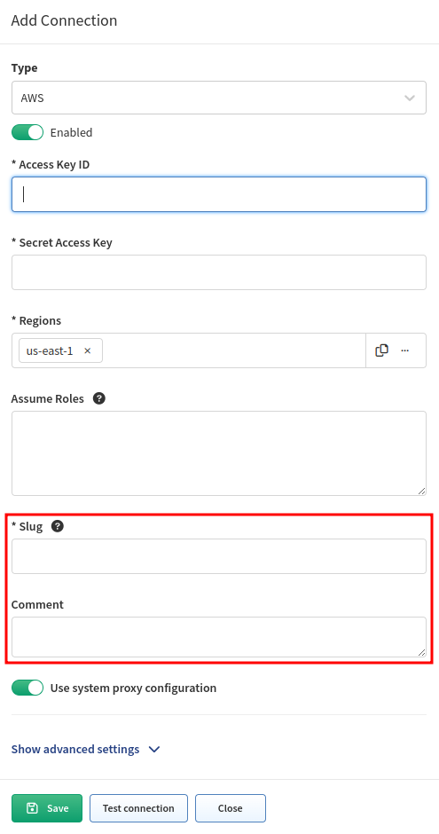
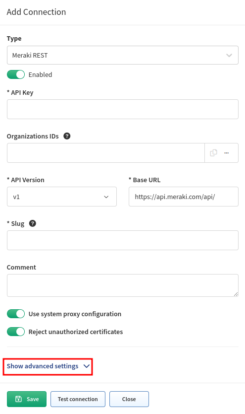

# Overview

IP Fabric supports discovery of network devices via **dedicated Vendor APIs**.

Currently, the following Vendor APIs are supported (as listed in **Settings -->
Discovery & Snapshots --> Discovery Settings --> Vendors API --> + Add -->
Type**):

- [AWS](AWS_Amazon_Web_Services.md)
- [Azure](Azure_Networking.md)
- [Check Point Management](Check_Point.md)
- [Cisco APIC](Cisco_APIC.md)
- [Cisco FMC](Cisco_FMC.md)
- [Forcepoint](forcepoint.md)
- [Google Cloud Platform](GCP_Google_Cloud_Platform.md)
- [Juniper Mist](juniper_mist.md)
- [Meraki REST](Cisco_Meraki.md)
- [Prisma](PaloAlto_Prisma.md)
- [Ruckus Virtual SmartZone](Ruckus_Virtual_SmartZone.md)
- [Silver Peak](Silver_Peak_SD-WAN.md)
- [VeloCloud](VeloCloud_SD-WAN.md)
- [Versa](Versa_Networks_SD-WAN.md)
- [Viptela](Cisco_Viptela_SD-WAN.md)
- [VMware NSX-T](VMware_NSX-T.md)

These APIs are often **complementary to the CLI-based** discovery process for
established networking vendors but are **essential** for **SD-WAN** or
**cloud vendors**.

This section describes per-API specific settings for supported APIs.

For each Vendor API, **additional system settings** can be applied.

!!! info "Multi-Factor Authentication"

    When configuring login credentials for Vendor API, please note that IP
    Fabric does not support multi-factor authentication (MFA). Please use a user
    account without MFA enabled (you may have the option to generate an
    `application access token`).

## Slug and Comment

Every instance of Vendor API configuration has two additional fields (the
example screenshot shows the AWS configuration).

**Slug**

: A slug must be unique and not empty. It is included in logs and other places
  to distinguish among potentially multiple API instances (think about it as
  the `loginIP` for the API). We recommend using short and descriptive values, such as
  `aws-us`, `aws-jp`, etc.

: **Since version `6.3`, a `Slug` can only contain `a-zA-Z0-9_-`. Previously
  created configurations will be automatically modified by removing not-allowed
  characters from the `Slug` according to the new validation rules.**

: !!! info "Slug?"

      Slug has many meanings, but in the computer world, it has become a term for
      the unique identifying part of a web address, typically at the end of the
      URL. For more information, see
      <https://developer.mozilla.org/en-US/docs/Glossary/Slug>.

**Comment**

: An optional free-text field for you to capture additional information about the
  API instance.

## Use System Proxy Configuration

The **system proxy** is by default used for communication from IP Fabric to the
Internet (e.g., for IP Fabric and system updates).

Some Vendor API controllers might be **on the Internet** or other parts
of the network, and sending traffic through the system proxy might be required.

This setting can be enabled/disabled per Vendor API.

## Reject Unauthorized Certificates

Due to **security reasons**, accepting unauthorized certificates might be
undesired.

This setting can be enabled/disabled per Vendor API.

## Advanced Settings

Since version `6.5`, it has been possible to fine-tune the following advanced settings
for each Vendor API in the GUI (without going directly to the database):

- Maximum concurrent requests
  - Maximum amount of API calls to a device that can run in parallel.
- `maxCapacity` (number of requests)
  - See [How API Discovery Works -- Rate Limiting](../../../../overview/How_Discovery_Works/API_discovery.md#rate-limiting).
- `refillRate` (number of requests per specified milliseconds)
  - See [How API Discovery Works -- Rate Limiting](../../../../overview/How_Discovery_Works/API_discovery.md#rate-limiting).

These are the default values for `Meraki REST`:

