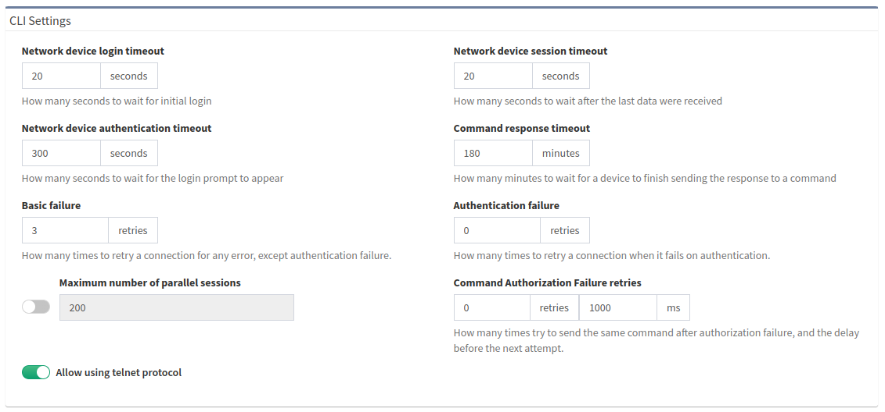
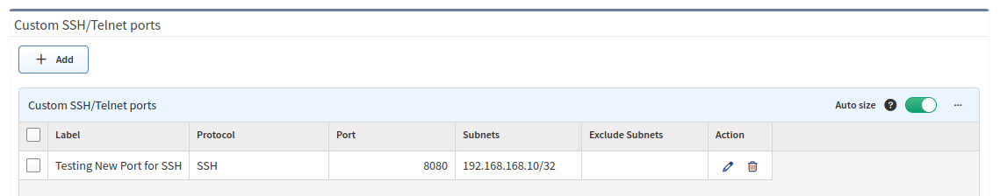

# Advanced CLI

## Fine-Tune SSH/Telnet CLI Parameters

IP Fabric primarily uses the Command-Line Interface
(CLI) for discovering network elements. The CLI parameters can be found in
**Settings --> Discovery & Snapshots --> Discovery Settings --> Advanced CLI**.

### Network Device Login Timeout

Timeout before the logging prompt is received. It may take longer for
remote branches over low-speed lines or overloaded devices to respond.

### Network Device Session Timeout

If there are too many **Command Timeout** errors during the discovery process, it may
indicate that the **Network device session timeout** is too short, and the session is closed before the response arrives. It may be necessary to increase this timeout.

### Maximum Number of Parallel Sessions

To prevent flooding your network with too many SSH/Telnet sessions, set
the **Maximum number of parallel sessions**. This setting can also be
helpful if the AAA server (TACACS/Radius) has a limit of parallel AAA
requests for users.

In rare cases, Cisco ISE or similar systems may rate limit
command authorization. If there are too many authorization failures
and Cisco ISE is in place, try limiting the number of parallel sessions
to 10 and steadily increasing.

### Basic Failure

This setting determines how many times to retry a connection for any error, except
authentication failure.

### Authentication Failure

**Authentication failure** can occur even if a user is authorized to
log in. For example, this may happen when an AAA server is overloaded, or
an authentication packet is lost.

### Command Authorization Failure Retries

If you see many examples of **Authentication error** during the
Discovery process, adjust **Authentication failure** and
**Command Authorization Failure retries**.

### Example of Error Message in Connectivity Report

According to the **Summary of issues** in the very first completed snapshot,
CLI Settings can be adjusted. Here are some of the most common
errors and adjustments:

| Error                                                                            | Error Type                    | How To Mitigate                                                                                                         |
| -------------------------------------------------------------------------------- | ----------------------------- | ----------------------------------------------------------------------------------------------------------------------- |
| connect ETIMEDOUT XX.XX.XX.XX:22                                                 | Connection error              | Received no response from the destination.                                                                              |
| connect ECONNREFUSED XX.XX.XX.XX:22                                              | Connection error              | The connection to the destination is being blocked by an access-list or firewall.                                       |
| All configured authentication methods failed                                     | Authentication error          | Unable to authenticate to the destination host.                                                                         |
| Authentication failed                                                            | Authentication error          | Unable to authenticate to the destination host.                                                                         |
| Authentication failed - login prompt appeared again                              | Authentication error          | Unable to authenticate to the destination host.                                                                         |
| SSH client not received any data for last 120000 ms! `cmd => show vrrp \| e #^$` | Command timeout               | The `show vrrp \| e #^$`  command timed out. Increase the **Network device session timeout**.                           |
| Can't detect prompt                                                              | Command timeout               | Unable to detect the CLI prompt. Increase the **Network device login timeout**.                                         |
| Command "enable" authorization failed, tried 2x                                  | Command authorization failure | The command wasn't authorized. Increase the **Command Authorization Failure retries** or increase the timer value (ms). |

## Custom SSH/Telnet Ports

!!! info

    **Custom SSH/Telnet ports** settings enable the discovery process to use different ports for connecting. The standard ports for SSH and Telnet are 22 and 23, respectively.

In the following example, we configure the discovery process to use port `8080`
for SSH connections to `192.168.168.10`:

As a result of such configuration, a new item will be created in the **Custom
SSH/Telnet ports** table, which will be applied to every new snapshot created in
IP Fabric.

## Telnet/SSH URL Handler on MS Windows 7 and Later

If you want to be able to connect directly to a device from the IP Fabric web
interface, you need to register a Telnet/SSH URL handler. You will be touching
the Windows Registry, so please ensure that you know what you are doing, have
appropriate backups, and are comfortable doing so.

### Backup Windows Registry

1. Click **Start**, type `regedit.exe` in the search box, and then press `Enter`.
2. In the Registry Editor, select **File --> Export**.
3. In the **Export Registry File** dialog, select the location where you want to save the backup copy, name your backup file, and click **Save**.

### PuTTY

#### Download PuTTY

1. Go to <https://www.chiark.greenend.org.uk/~sgtatham/putty/latest.html>.
2. Download PuTTY.
3. This tutorial expects PuTTY being in `C:\Program Files (x86)\putty.exe`.

#### Register Telnet/SSH URL Handler

1. Go to <https://gist.github.com/sbiffi/11256316>.
2. Download the `putty.reg` file.
3. In `putty.reg`, edit the path to PuTTY if it differs from `C:\Program Files (x86)\putty.exe`.
4. Download `putty.vbs` (save it to `C:\putty.vbs` or change this path in `putty.reg` above).
5. In `putty.vbs`, edit the path to PuTTY if it differs from `C:\Program Files (x86)\putty.exe`.
6. Launch `putty.reg` to associate `ssh://` and `telnet://` to this script.

### SecureCRT

#### Download SecureCRT

SecureCRT is not free software. To obtain a SecureCRT license, please visit <https://www.vandyke.com/products/securecrt/>.

#### Register Telnet/SSH URL Handler

1. Download [securecrt.reg](advanced_cli/securecrt.reg).
2. Edit the path to SecureCRT if it differs from `C:\Program Files\VanDyke Software\SecureCRT\SecureCRT.exe`.
3. Launch `securecrt.reg` to associate `ssh://` and `telnet://` to SecureCRT.
