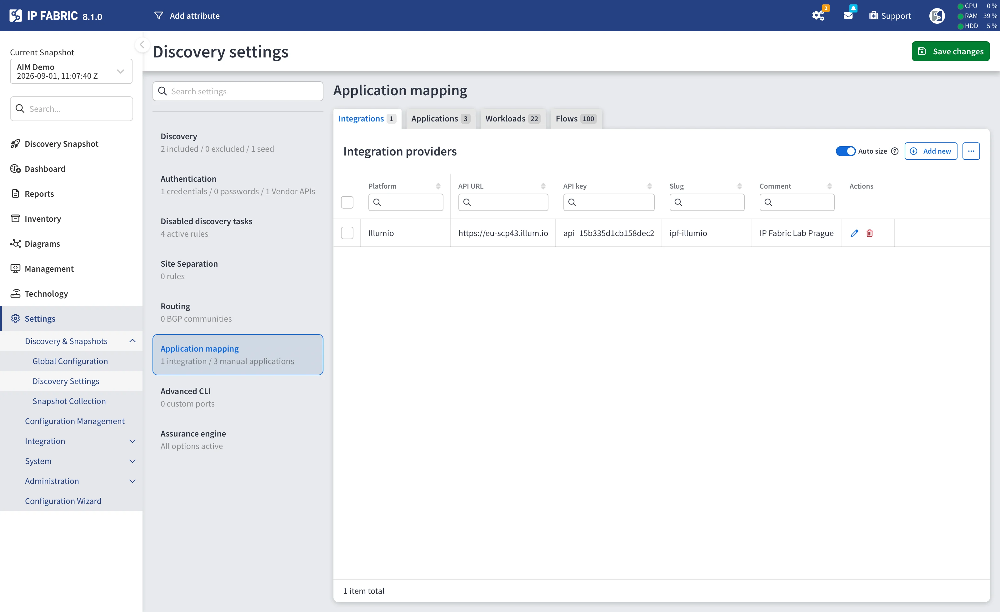
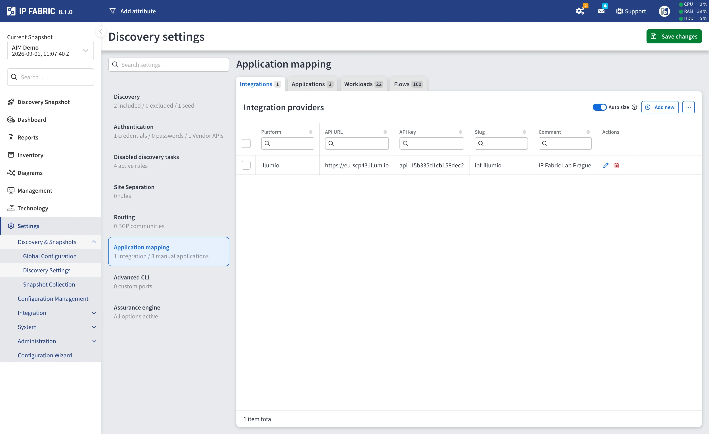
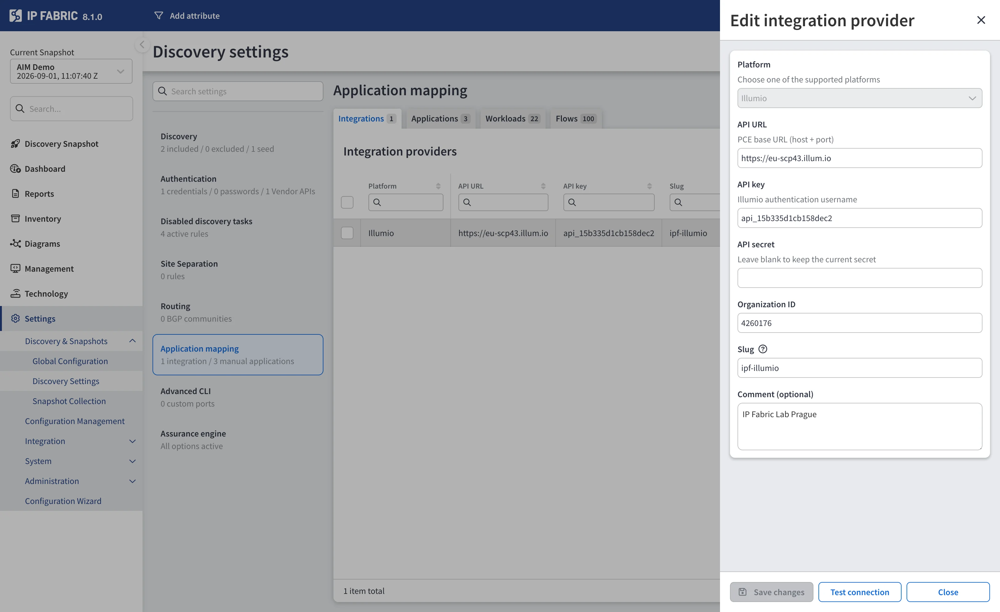
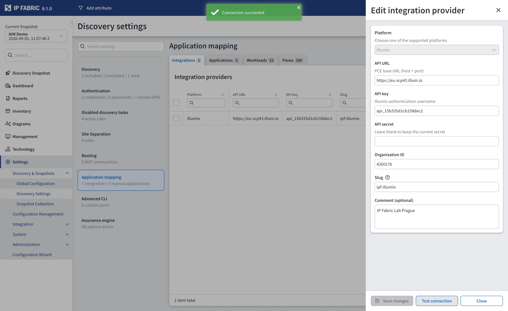
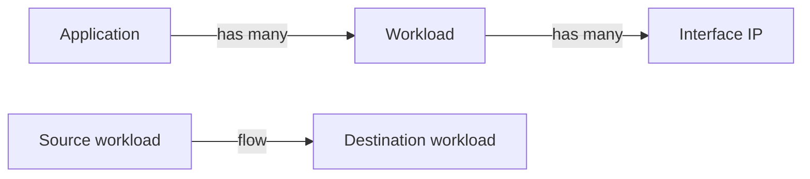
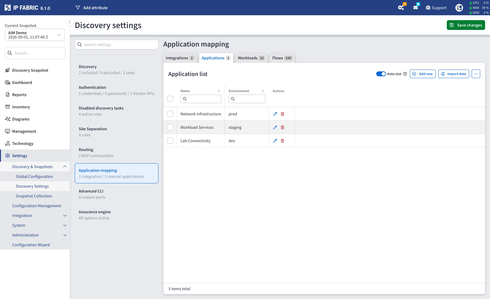
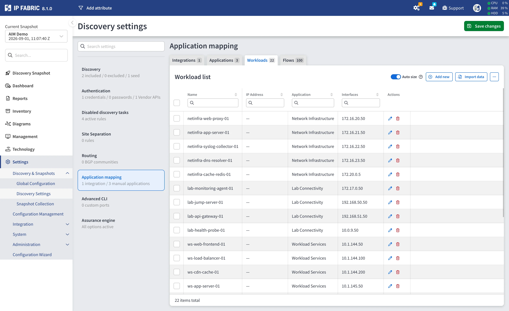
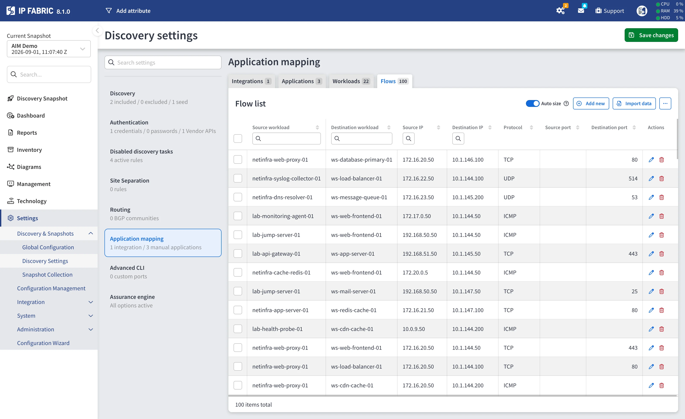
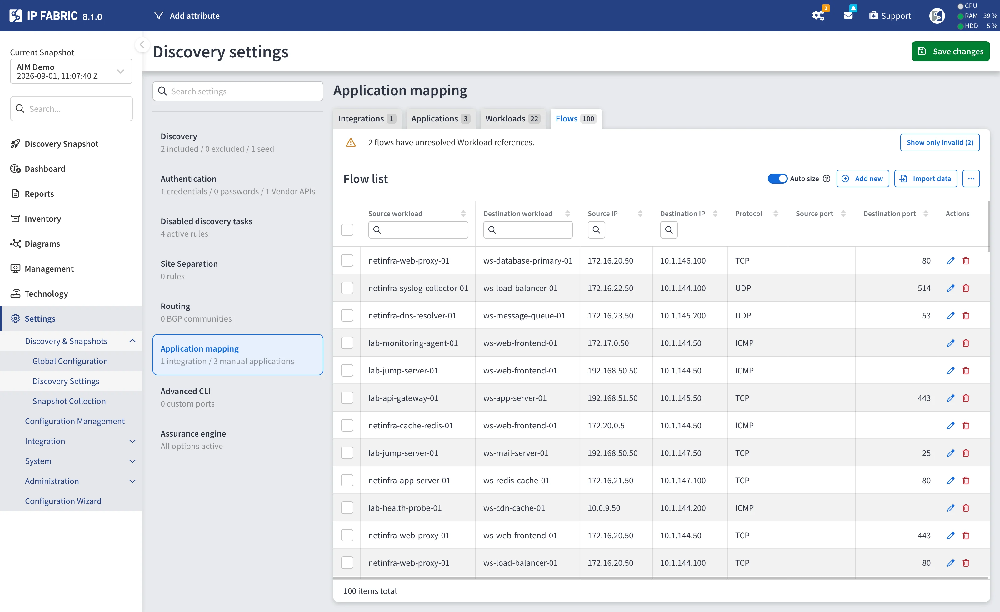
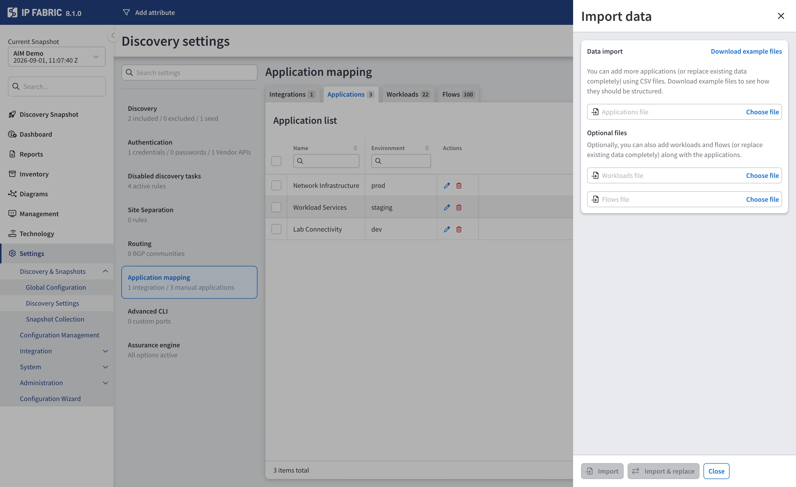

# Application Mapping

--8<-- "snippets/aim_license_required.md"

Application Infrastructure Mapping (AIM) correlates your application inventory --
applications, workloads, workload interfaces, and flows -- with the network model
that IP Fabric discovers.

The data that feeds AIM is configured in **Settings --> Discovery & Snapshots -->
Discovery Settings --> Application mapping**. The section holds two distinct
things:

- **Integrations** -- connections to external data providers that IP Fabric
  crawls during discovery. Illumio is currently supported.
- **Applications**, **Workloads**, and **Flows** -- records you maintain
  directly in IP Fabric, either by filling in a form or by importing CSV files.

Both sources feed the same AIM inventory and can be used side by side.

Without the AIM feature on the license, the **Application mapping** menu item is
hidden and the AIM inventory pages show a feature overview instead.

The menu item shows a summary of what is configured -- for example
`2 integrations / 5 manual applications`.

## Global and Snapshot Scope

Application mapping is available in two places, and they are independent:

| Scope        | Where                                                        | Applies to                                       |
| :----------- | :----------------------------------------------------------- | :----------------------------------------------- |
| **Global**   | **Settings --> Discovery & Snapshots --> Discovery Settings** | Every new discovery started from these settings. |
| **Snapshot** | The **Settings** of an individual snapshot                    | That snapshot only.                              |

The tabs, forms, and validation are identical in both scopes. Editing a
snapshot's settings never changes the global defaults, and changing the global
settings does not retroactively alter existing snapshots.

## Sub-Tabs

The section is split into four tabs, each showing a count of the records it
holds:

| Tab              | Contents                                                        |
| :--------------- | :--------------------------------------------------------------- |
| **Integrations** | Connections to external AIM data providers.                      |
| **Applications** | Manually maintained applications.                                |
| **Workloads**    | Manually maintained workloads, each belonging to an application.  |
| **Flows**        | Manually maintained flows between two workloads.                  |

## Integrations

The **Integrations** tab lists the external data providers IP Fabric queries for
application data. The **Integration providers** table shows the **Platform**,
**API URL**, **API key**, **Slug**, and **Comment** of each configured provider.

Use **Add new** to create a provider, the pencil icon to edit one, and the bin
icon to remove one. Selecting several rows enables a bulk **Delete**.

### Add or Edit an Integration Provider

| Field               | Required | Description                                                                                                                 |
| :------------------ | :------- | :-------------------------------------------------------------------------------------------------------------------------- |
| **Platform**        | yes      | The data provider type. `Illumio` is currently the only supported option, so the field is preselected.                       |
| **API URL**         | yes      | The Illumio PCE base URL, including host and port -- for example `https://pce.example.com:8443`. Must start with `https://`. |
| **API key**         | yes      | The Illumio API key ID. It is used as the authentication username.                                                          |
| **API secret**      | yes\*    | The Illumio API key secret. Stored encrypted and never displayed again after saving.                                        |
| **Organization ID** | yes      | The Illumio PCE organization ID. It forms part of the request path IP Fabric calls.                                         |
| **Slug**            | yes      | A short unique identifier for this configuration -- for example `illumio-eu`. Maximum 64 characters, letters, digits, `-` and `_` only. Must be unique across integrations. |
| **Comment**         | no       | Free-form note.                                                                                                             |

\* When editing an integration that already has a stored secret, leave **API
secret** blank to keep the current value. The field is only mandatory when
adding a provider, or when editing one that has no secret stored yet.

### Illumio Requirements

To crawl an Illumio PCE, IP Fabric needs REST API access:

- An **API key** created in the Illumio PCE, consisting of a key ID and a secret.
  IP Fabric authenticates every request with these as HTTP Basic credentials --
  Illumio has no separate login step.
- Read access to the organization's **labels**, **workloads**, and
  **traffic flows**, since these are what IP Fabric maps to AIM applications,
  workloads, and flows.
- Network reachability from the IP Fabric appliance to the PCE over HTTPS. The
  connection is made with certificate validation enabled, and the system proxy
  configuration is honoured.

!!! note "Traffic flow collection is time-boxed and capped"

    When IP Fabric queries the PCE for traffic flows, it asks for a rolling
    window of the **last 24 hours** and caps the query at **25,000 flows**.
    Traffic that falls outside that window, or beyond the cap, is not ingested.

    Both values are **fixed in this release** -- there is no setting for them in
    the integration form or anywhere else in the UI. They apply to flow
    collection only: applications, workloads, and their labels are not limited
    this way.

    In practice this means the Flows tab reflects what the PCE observed over the
    last day, not the full history, and that a busy environment can reach the cap
    on a single discovery run.

### Test Connection

The integration dialog has a **Test connection** button that verifies the
provider is reachable and the credentials are accepted -- without saving the
form and without starting a discovery.

The form is validated first, so any missing or malformed field is reported
before a request is sent. The test then performs a minimal read against the PCE:
a single-result label query. Because Illumio authenticates every request
individually, this one call confirms reachability, credentials, and the
organization ID together.

The outcome appears as a notification:

- **Connection succeeded** -- the provider answered and accepted the credentials.
- **Connection failed** -- with the reason reported by the appliance, for example
  an unreachable URL or rejected credentials.

!!! tip "Testing a saved provider without retyping its secret"

    You can test a stored integration with the **API secret** field left blank.
    The appliance reads and decrypts its own copy of the secret, so it never has
    to travel back through the browser. Any other field you changed in the form
    is still applied to the test, which lets you validate an edit -- a new URL,
    for example -- before saving it.

The same test is available over the API. See
[Verify an AIM Integration Connection](../../../IP_Fabric_API/Application_Infrastructure_Mapping/index.md#verify-an-aim-integration-connection).

### When the Data Is Collected

Configured integrations are crawled as part of **discovery**. Adding a provider
does not import anything on its own -- run a new discovery, so IP Fabric queries
the provider and stores the results in the resulting snapshot.

## Applications, Workloads, and Flows

The remaining three tabs hold AIM data entered directly in IP Fabric, for cases
where no integration exists or where you want to model an application by hand.
Each tab has an **Add new** button, an **Import data** button, and per-row edit
and delete actions.

The three record types form a hierarchy: a **workload** belongs to an
**application**, and a **flow** connects two **workloads**.

### Applications

The **Application list** table shows **Name** and **Environment**.

| Field           | Required | Description                                              |
| :-------------- | :------- | :------------------------------------------------------- |
| **Name**        | yes      | The application name shown throughout the AIM inventory. |
| **Environment** | no       | Free-text environment label, for example `prod`.         |

### Workloads

The **Workload list** table shows **Name**, **IP Address**, **Application**, and
**Interfaces**.

| Field           | Required | Description                                                                         |
| :-------------- | :------- | :---------------------------------------------------------------------------------- |
| **Application** | yes      | The application this workload belongs to, picked from the applications you defined. |
| **Name**        | yes      | The workload name.                                                                  |
| **IP address**  | no       | The workload's primary address.                                                     |
| **Interfaces**  | yes      | One or more interface IP addresses. At least one is required.                        |

### Flows

The **Flow list** table shows **Source workload**, **Destination workload**,
**Source IP**, **Destination IP**, **Protocol**, **Source port**, and
**Destination port**.

| Field                    | Required | Description                               |
| :----------------------- | :------- | :---------------------------------------- |
| **Source workload**      | yes      | The workload the traffic originates from. |
| **Destination workload** | yes      | The workload the traffic is sent to.      |
| **Source IP**            | yes      | Valid IPv4 or IPv6 address.               |
| **Destination IP**       | yes      | Valid IPv4 or IPv6 address.               |
| **Protocol**             | yes      | One of `ICMP`, `TCP`, `UDP`, or `ICMPv6`. |
| **Source port**          | no       | `0`-`65535`.                              |
| **Destination port**     | no       | `0`-`65535`.                              |

### Unresolved References

Because the three record types reference each other, deleting or renaming one
can leave another pointing at something that no longer exists -- a workload
whose application was removed, or a flow whose workload was removed.

Affected tabs show a warning banner, for example
`3 workloads have unresolved Application references`, with a **Show only
invalid** button that filters the table down to the affected rows.

!!! warning "Unresolved references block saving"

    The settings form refuses to save while any record has an unresolved
    reference, reporting `Cannot save: N records have unresolved references. Fix
    or delete those records to save.` Reassign the affected rows or delete them,
    then save again.

### Import From CSV

Each of the three tabs has an **Import data** button that opens an import panel.

- **Download example files** provides correctly structured CSV templates.
- The tab's own record type is the main file, and the other two are optional --
  so you can, for example, import applications, workloads, and flows in one go
  from the Applications tab.
- Each file is limited to **10 MB**.

Two import modes are offered:

| Button               | Behavior                                                                    |
| :------------------- | :-------------------------------------------------------------------------- |
| **Import**           | Adds the rows from the files to the records already present.                |
| **Import & replace** | Replaces the existing records of each supplied type with the file contents. |

The expected columns are:

| File             | Columns                                                                                   |
| :--------------- | :---------------------------------------------------------------------------------------- |
| **Applications** | `id`, `name`, `environment`                                                               |
| **Workloads**    | `id`, `applicationId`, `name`, `ipAddress`, `interfaces (list of IP addresses)`           |
| **Flows**        | `id`, `srcWorkloadId`, `dstWorkloadId`, `srcIp`, `dstIp`, `protocol`, `srcPort`, `dstPort` |

`id` is optional -- leave it empty and IP Fabric generates one. Supply it when
you need workloads and flows in the same import to reference the applications
and workloads by ID. `protocol` is the numeric value: `1` for ICMP, `6` for TCP,
`17` for UDP, `58` for ICMPv6.

After processing, a summary reports how many records of each type were imported
and lists the rows that failed, so a partially valid file still imports its good
rows.

!!! warning "This is not the same CSV format as the AIM import API"

    The import in this settings panel and the
    [AIM import API endpoint](../../../IP_Fabric_API/Application_Infrastructure_Mapping/index.md#import-aim-data-from-csv-files)
    use **different column names**. The settings import links records with
    IP Fabric `id` values, while the API import uses your own `externalId` keys
    and a separate interfaces file. Use the example files from the panel for the
    settings import, and the documented API schema for the endpoint.

Imported records are only stored once you **save** the settings form.

## Where the Data Appears

Once AIM data has been ingested -- by discovery for integrations, or by saving
the settings form for manual records -- it is available under
**Inventory --> Applications**, in the Applications, Workloads, Flows, and
Devices tables.

The **Devices** table is not populated by ingestion. It lists the network devices
that an application's traffic traverses, which is produced by a separate
on-demand path-lookup calculation started from the Applications or Flows table.

## Related Documentation

- [Application Infrastructure Mapping API](../../../IP_Fabric_API/Application_Infrastructure_Mapping/index.md)
  -- ingesting AIM data from CSV files, calculating path lookups, and reading the
  AIM inventory tables over the API.
- [Using AIM Through the MCP Server](../../../IP_Fabric_API/Application_Infrastructure_Mapping/mcp_server_guide.md)
  -- working with AIM data from an AI assistant.
