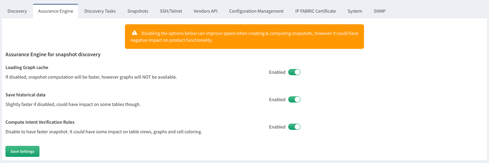

# Assurance Engine

Since version `6.0`, IP Fabric can skip some of the discovery features to decrease discovery time.

The **Assurance Engine** section allows you to disable the following features to speed up discovery process, but it will also limit application features:

1. **Loading Graph cache**

   Site Diagrams and End To End Path check will not be able to load diagrams. The Sites list under the Inventory menu will be available, however you will not be able to open any of the sites.

2. **Save historical data**

   Tables under **Management --> Changes** will not be updated, so you will not be able to compare removed/added devices between snapshots.

3. **Compute Intent Verification Rules**

   Dashboard intent verification widgets will be empty.

   Intent verification rules for all tables and graphs will not be available and will be empty.

   Both default and custom intent verification rules will be affected.

## Usage

For new snapshots, go to **Settings --> Discovery & Snapshots --> Discovery Settings --> Assurance Engine** and make desired changes.

For existing snapshots, update the **Assurance Engine** settings in the snapshot settings.
