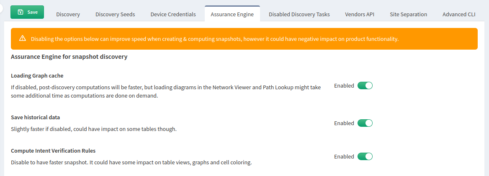

# Assurance Engine

Since version `6.0`, IP Fabric can skip some of the discovery features to decrease discovery time.

The **Assurance Engine** section allows you to disable the following features to speed up the discovery process, but it will also limit application features:

1. **Loading Graph cache**

   Disabling this task is especially useful in large networks. By disabling this, topology calculations at the end of discovery are skipped. The Network Viewer (Site Diagrams) and Path Lookup (End to end path, Host to Gateway path) are still able to load diagrams; they will just be slower as the topology is not cached and needs to be calculated on demand.

2. **Save historical data**

   Tables under **Management --> Changes** will not be updated, so you will not be able to compare added/removed devices between snapshots.

3. **Compute Intent Verification Rules**

   Dashboard intent verification widgets will be empty.

   Intent verification rules for all tables and graphs will not be available and will be empty.

   Both default and custom intent verification rules will be affected.

## Usage

For new snapshots, go to **Settings --> Discovery & Snapshots --> Discovery Settings --> Assurance Engine** and make desired changes.

For existing snapshots, update the **Assurance Engine** settings in the snapshot settings.
