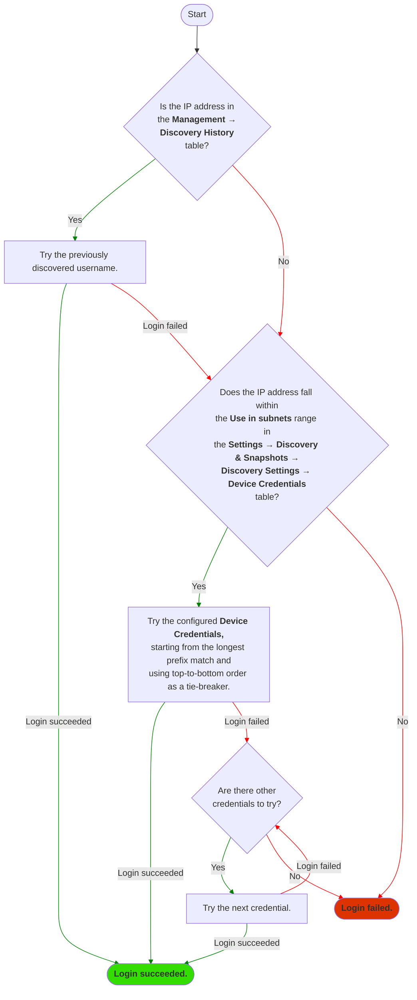

# Device Credentials

IP Fabric interacts with the network infrastructure devices by running show
commands through CLI using SSH or Telnet. Credentials added in **Settings -->
Discovery & Snapshots --> Discovery Settings --> Device Credentials** will be
used by IP Fabric to access the CLI of the network devices.

## Credential Selection Logic

The credential priority can be changed using drag and drop. The credential 
selection algorithm will match the device's IP address to the subnets specified
in the credential's **Use in subnets** field, and will try the credentials in the 
order of the longest prefix match. Within the same prefix match length, the 
credentials are tried in top-down order.



## Configure Network Infrastructure Access

Read-only (Privilege 1) credentials are sufficient for basic functionality.
Security-sensitive operations and advanced functionality might require higher
privileges. See the
[full list of used command in the documentation](https://matrix.ipfabric.io/).

When adding new credentials, you can limit the validity of the credentials just
for a part of your network using the **Use in subnets**
and **Don't use in subnets** fields. Please be aware that the **Use in subnets** 
field will also affect the credential selection algorithm.


Provided credentials can be used for configuration change tracking and saved
configuration consistency (i.e., they allow commands such as `show run` and
`show start`).

To use these credentials for configuration change tracking, please
check the [Use for configuration management](../../configuration_management.md)
box.

!!! warning "Password Character Restrictions"

    The password will only be decrypted if ASCII characters are used. If you are
    using special characters, please make sure that the password is within the
    ```[A-Za-z0-9+-!?@#$%^&*()_`~[]{}<>,./|\:;'" ]``` range.

## (Optional) Passwords for Enable Mode

Privileged credentials are generally only necessary for configuration
management. However, some platforms require privileged credentials to access
basic network state information, such as MST spanning-tree state or 802.1X
session information.


