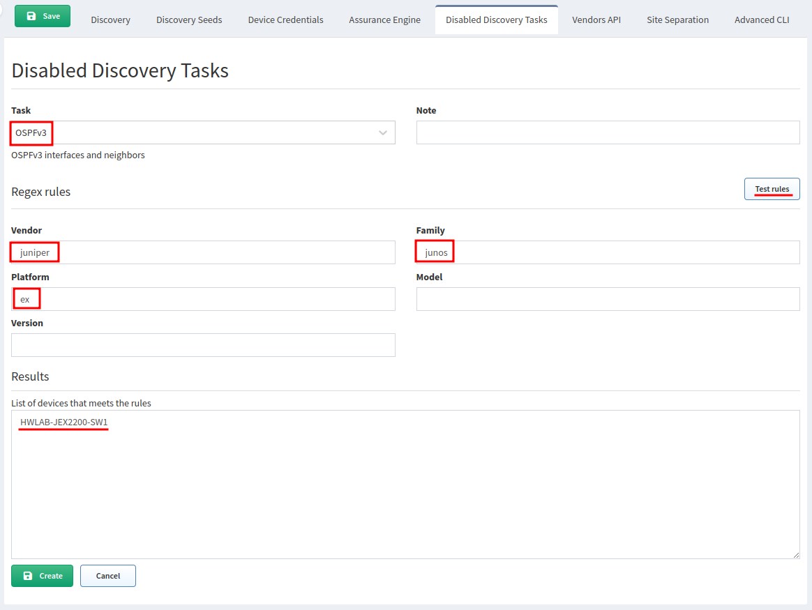

# Disabled Discovery Tasks

The discovery process for network devices is divided into multiple Tasks.
The TASK is a data collection related to a specific network protocol or
technology (MPLS, Transceivers, ARP Table, Spanning-Tree Protocol,
Multicast, or VXLAN). Each task consists of 1 or more operational
commands (CLI or API). You can find the list of all Discovery Tasks
in the [Feature matrix](https://matrix.ipfabric.io).

Some fundamental TASKS are critical for discovery and topology calculations
(Neighbors, ARP, Mac, RIB, etc.).

The **Disabled Discovery Tasks** settings were introduced in version `3.7.0`.
Since then, the user can manipulate specific tasks for the discovery process
to avoid extra data collection (when particular protocols are not
present on the network) or avoid specific operational commands to be
executed on specific hardware platforms.

!!! warning

    Disabling TASKS will reduce the level of information collected by IP Fabric.
    If some fundamental TASKS are disabled, it can affect the topology or Path
    Lookup results.

## Default Disabled Discovery Tasks

Since version `6.3.0`, **Disabled Discovery Tasks** contain the following three
predefined rules:

| **Rule Name**        | **Rule Description**                                                                                                   |
| :------------------- | :--------------------------------------------------------------------------------------------------------------------- |
| `Disable Pagination` | By default disabled for F5 devices - the command is modifying the configuration and can break cluster synchronization. |
| `Transceivers`       | By default disabled for all vendors - certain Cisco platforms may be affected by a memory leak bug and lead to device crash or hung VTY line. More in [Known Issues --> Cisco](../../../support/known_issues/Vendors/cisco/index.md). |
| `NTP`                | By default disabled for Cisco Firepower - on some versions, a Firepower bug may freeze the CLI session.                |

Prior to version `6.3.0`, the `Configuration saved` rule (disabling for all
vendors) was also present by default. New deployments of version `6.3.0` or
newer do not have the rule predefined anymore. Upgrading from version `6.2.2`
or older does not automatically remove the previously predefined rule.

## Example of Adding New Disabled Discovery Task

In the following example, we are creating a rule to disable OSPFv3 on
Juniper EX. The test for the rule reveals one match, the
`HWLAB-JEX2200-SW1` switch:

